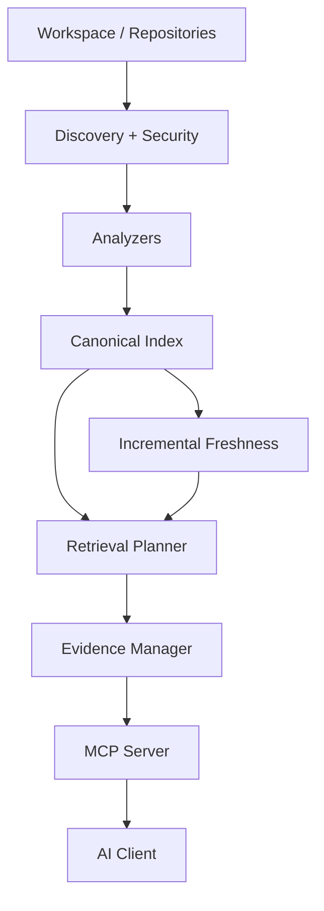

# Attic

Attic is a local MCP server that gives AI coding agents persistent,
evidence-backed understanding of large codebases and multi-repository
workspaces.

## Why Attic?

- **Fast code search** — full-text search over indexed content, not a slow re-grep every turn.
- **Structural understanding** — symbols, definitions, and relationships for supported languages.
- **Incremental indexing** — a filesystem watcher keeps the index current without full rebuilds.
- **Evidence-backed context** — answers are checked against real source spans, with an explicit `INSUFFICIENT_EVIDENCE` result instead of a guess.
- **Multi-repository relationships** — cross-repo dependency resolution across a workspace of many repositories.
- **Curated project knowledge** — a `knowledge/` tier for facts that aren't obvious from source.
- **Local-first** — runs entirely on your machine; nothing leaves it unless you opt in to the (disabled-by-default) semantic layer.

## Quick Start

No Rust, Cargo, or a native compiler required — this downloads a prebuilt
binary and verifies its checksum before installing it (no admin/sudo).

**Linux / macOS:**

```sh
git clone https://github.com/aman-5/attic
cd attic
./setup.sh
```

**Windows (PowerShell):**

```powershell
git clone https://github.com/aman-5/attic
cd attic
./setup.ps1
```

Each script detects your platform, downloads the matching release archive
and its published SHA-256 checksum over HTTPS, refuses to install if the
checksum doesn't match, and installs the binary under your user-local data
directory (no system-wide changes). It finishes by printing the exact MCP
configuration block below with your installed binary's path filled in.

Building from source is also supported and is the right choice if you're
contributing to Attic itself — see [Build from Source](#build-from-source).

## Connect to your AI/MCP client

Attic is an MCP server: transport is **stdio**. Your AI client starts the
Attic process directly (no port, no daemon, no `localhost` URL); Attic
indexes and maintains the workspace you point it at, and the client calls
Attic's tools when it needs repository knowledge.

Add it to your client's MCP server configuration:

**Recommended (no environment variables needed):** just add the server —
Attic connects even with nothing configured, then you configure it by simply
telling your AI client:

> Configure Attic with these repositories:
> `C:\Users\me\Desktop\Dump`
> `C:\work\HDFC`
> `D:\repos\HDFC-Bank-on-prem`

The AI invokes Attic's `workspace` MCP tool; Attic validates the roots,
persists them atomically to `~/.attic/config.toml` (override the location
with `ATTIC_HOME`), indexes and watches each repository, and reloads the
same workspace automatically on every subsequent launch. Roots may live
anywhere on disk — no common parent, no symlinks, one process, one database.

```json
{
  "mcpServers": {
    "attic": {
      "command": "/absolute/path/to/attic-server",
      "args": [],
      "env": {}
    }
  }
}
```

**Windows example:**

```json
{
  "mcpServers": {
    "attic": {
      "command": "C:\\Users\\you\\.attic\\bin\\attic-server.exe",
      "args": [],
      "env": {
        "ATTIC_WORKSPACE_ROOT": "C:\\Users\\you\\code\\myrepo"
      }
    }
  }
}
```

**Linux/macOS example:**

```json
{
  "mcpServers": {
    "attic": {
      "command": "/home/you/.attic/bin/attic-server",
      "args": [],
      "env": {
        "ATTIC_WORKSPACE_ROOT": "/home/you/code/myrepo"
      }
    }
  }
}
```

This configuration shape is client-neutral: place the same
command/args/env into whichever MCP-server settings your client exposes
(Claude Code, Claude Desktop, or any other MCP-capable client).

## Use Attic

Once connected, just ask your AI client questions about the workspace — it
invokes Attic's MCP tools automatically. You don't need to construct MCP
JSON-RPC requests by hand. For example:

```text
"Find where authentication tokens are validated."
"Show me every implementation of PaymentProvider."
"Which repositories depend on the shared auth package?"
"If I change UserService.create(), what may be affected?"
"Explain how checkout flows from the API to persistence."
"Find the configuration controlling retry behavior."
```

On first start with `ATTIC_WORKSPACE_ROOT` set, Attic performs a one-time
synchronous index before it starts serving MCP requests — the first tool
call already sees current data — then watches the workspace for changes
(native filesystem watcher, falling back to periodic reconciliation) and
re-indexes incrementally. Canonical search (`search`/`file`/`repo_map`)
works as soon as this initial index completes; it does not wait on the
optional semantic layer, which is disabled by default.

## MCP Tools

| Tool | Purpose |
|---|---|
| `search` | Full-text search over indexed workspace content |
| `file` | Read a bounded, verified region of a file from the live workspace |
| `repo_map` | Structural overview of a repository |
| `context` | Evidence-backed answer to a natural-language question (`FAST` / `NORMAL` / `DEEP` modes) |
| `status` | Server/indexing health, watcher mode, resource-pressure advisory |
| `workspace` | Inspect and manage configured repository roots at runtime (`inspect` / `add` / `remove` / `set`), persisted to `<ATTIC_HOME>/config.toml` |

Call `status` any time to check readiness: it reports whether indexing is
current (`incremental.state`), which watcher mechanism is active
(`watcher.mode`), cross-repository health, and resource pressure. Exact
tool schemas are defined once in
`crates/attic-server/src/main.rs::make_tools()` and returned via
`tools/list` — that function is the single source of truth for the tool
surface.

## Workspaces & Multiple Repositories

**Configuration precedence** (deterministic, never silently combined):

1. `ATTIC_CONFIG=<path>` — explicit multi-root config file
2. `<ATTIC_HOME>/config.toml` (default `~/.attic/config.toml`) — persistent
   workspace config, written automatically by the `workspace` MCP tool
3. `ATTIC_WORKSPACE_ROOT=<path>` — legacy single-repository convenience
4. none — UNCONFIGURED first run; configure through the `workspace` MCP tool

**Single repository (legacy):**

```sh
# .env / MCP client config
ATTIC_WORKSPACE_ROOT=/home/you/projects/my-app   # or C:\projects\my-app
```

**Multiple repositories, anywhere on disk:** a realistic workspace is
rarely one directory tree — repositories often live in unrelated
locations with no common parent, e.g.:

```text
C:\Users\<username>\Desktop\Dump
C:\Users\<username>\Path1
C:\Users\<username>\Path3
```

Set `ATTIC_CONFIG` to a small config file listing each root explicitly —
no symlinks, no moving repositories under one directory, no Git
submodules, and no additional MCP entries/databases:

```text
[[repositories]]
path = "C:\Users\<username>\Desktop\Dump"

[[repositories]]
path = "C:\Users\<username>\Path1"

[[repositories]]
path = "C:\Users\<username>\Path3"
```

```sh
# .env / MCP client config
ATTIC_CONFIG=/absolute/path/to/attic-workspace.conf
```

`ATTIC_CONFIG` and `ATTIC_WORKSPACE_ROOT` are mutually exclusive — set only
one. Each configured root is validated (must exist, be a directory,
canonicalize) and indexed/watched independently; a root that fails
validation is skipped (logged) rather than failing the other configured
repositories. Cross-repository dependency resolution (`attic-crossrepo`)
then runs automatically at startup across every repository currently
known to storage, resolving edges like "which repositories depend on the
shared auth package" from each repository's own manifests (`package.json`,
`pom.xml`, `go.mod`, `.gitmodules`, etc.) — arbitrary, unrelated roots work
exactly like repositories that happen to share a parent directory.

A **single** `attic` process owns one logical workspace and one
database: one coordinated writer queue, one MCP transport, one watcher
per configured repository. Attic does **not** support multiple `attic-server` processes writing to the same database
concurrently — give each concurrently running instance its own
`ATTIC_HOME`.

## Project Knowledge

```text
my-project/
├── src/
├── tests/
├── docs/
└── knowledge/
    ├── architecture.md
    ├── domain.md
    ├── conventions.md
    └── ownership.md
```

Any Markdown file under `knowledge/**` in an indexed repository is treated
as curated **Project Knowledge** — Attic's highest documentation authority
tier — with no configuration change required beyond it existing on disk;
Attic's incremental watcher indexes and re-indexes it exactly like source.
Everything else (`README.md`, `docs/**`, an `ARCHITECTURE.md` outside
`knowledge/`) is ordinary documentation: still fully searchable, just not
elevated to the same authority.

Put in `knowledge/`: architecture intent, domain terminology, ownership,
conventions, deployment assumptions, decisions not obvious from source.
Never put in `knowledge/`: secrets, API keys, or transient chat
instructions — knowledge files are indexed and served through the same
tools as source code.

This is optional — a repository with no `knowledge/` directory works the
same, just without that top evidence tier. See `knowledge/README.md` in
this repository for a ready-to-copy template.

## Language Support

| Input | Analyzer | Result |
|---|---|---|
| Any text file | `GenericAnalyzer` | Full-text search, no symbols |
| Java / Python / Go / JavaScript / TypeScript | Structural (tree-sitter) | Symbols, definitions, relationships |
| Rust / Swift / C++ / Kotlin / etc. | `GenericAnalyzer` (today) | Full-text search; a dedicated structural analyzer can be added later |

Rich language support is additive, not a gate on usability — every
text-based file in your workspace is searchable from the first index,
regardless of language.

## How It Works



Repositories on disk are always the source of truth; every index, graph,
and cache is derived and disposable. See
[`docs/ARCHITECTURE.md`](docs/ARCHITECTURE.md) for the full pipeline,
retrieval/evidence model, incremental-recovery behavior, and
cross-repository diagrams.

## Configuration

All configuration is via environment variables — there are no CLI flags.

| Variable | Purpose |
|---|---|
| `ATTIC_WORKSPACE_ROOT` | Single repository root to index and watch. Omit to start UNCONFIGURED (no `~/.attic/config.toml`) or resume from persistent config. Mutually exclusive with `ATTIC_CONFIG`. |
| `ATTIC_CONFIG` | Path to a workspace config file listing multiple `[[repositories]]` roots (arbitrary locations, no common parent required). Mutually exclusive with `ATTIC_WORKSPACE_ROOT`. See [Workspaces & Multiple Repositories](#workspaces--multiple-repositories). |
| `ATTIC_HOME` | Overrides the Attic application home directory (default: `~/.attic`). Config, database, and runtime state all derive from this location. An empty `ATTIC_HOME` is a startup error — unset it or provide a valid path. |
| `ATTIC_DB_PATH` | Legacy single-variable override; the data dir is derived from its parent. |
| `ATTIC_SEMANTIC` | Set to `1` to opt in to the (disabled-by-default, experimental) semantic retrieval layer — see [Semantic search](#semantic-search-optional). |
| `ATTIC_LOG` / `RUST_LOG` | Log verbosity (`tracing`'s `EnvFilter` syntax); defaults to `info`. `ATTIC_LOG` takes precedence when both are set. |
| `ATTIC_TOTAL_MEMORY_BUDGET_MIB` | Total memory budget enforced by the resource monitor. |
| `ATTIC_MAX_FOREGROUND_QUERIES` | Concurrent foreground MCP query cap. |
| `ATTIC_MAX_BACKGROUND_WORKERS` | Concurrent background (indexing/semantic) worker admission cap enforced by the resource monitor (`attic-storage::resource_manager`). Distinct from `ATTIC_MAX_INDEXING_WORKERS` below, which bounds the indexing pipeline itself. |
| `ATTIC_MAX_INDEXING_WORKERS` | Maximum concurrent indexing workers, so indexing never starves foreground queries (`attic-core::config::ProductionConfig`). |
| `ATTIC_MIN_FREE_MEMORY_MIB` / `ATTIC_PER_REPO_MEMORY_BUDGET_MIB` / `ATTIC_MAX_IO_OPS_PER_SEC` | Additional resource-pressure tuning — see `crates/attic-storage/src/resource_manager.rs`. |
| `ATTIC_WRITER_BATCH_SIZE` / `ATTIC_WRITER_FLUSH_INTERVAL_MS` / `ATTIC_WRITER_QUEUE_CAPACITY` | Writer-queue tuning for indexing throughput. |
| `ATTIC_INCREMENTAL_TASK_QUEUE_CAPACITY` / `ATTIC_RECONCILIATION_TASK_QUEUE_CAPACITY` | Maximum pending incremental / reconciliation task-queue depth. |
| `ATTIC_MAX_GRAPH_DEPTH` / `ATTIC_MAX_GRAPH_NODES` | Bounds on graph traversal depth/breadth during evidence expansion. |
| `ATTIC_MAX_CONTEXT_TOKENS` | Maximum tokens consumed by context building for a single `context` query (default `8192`). |
| `ATTIC_DEFAULT_TASK_TIMEOUT_MS` | Default timeout for background tasks; tasks exceeding it are cancelled and rescheduled. |
| `ATTIC_BACKUP_RELATIVE_DIR` / `ATTIC_MAX_BACKUP_RETAIN` | Crash-recovery backup directory (relative to the database path) and how many checkpoints to retain (REC-B2, default 3). |
| `ATTIC_CHECKPOINT_WAL_FRAMES` / `ATTIC_CHECKPOINT_MINUTES` / `ATTIC_WAL_AUTOCKPT_ENABLED` | WAL checkpoint interval (by frame count or elapsed time, whichever comes first) and whether auto-checkpointing is enabled. |
| `ATTIC_GRACEFUL_SHUTDOWN_TIMEOUT_MS` | How long the server waits for in-flight tasks to complete on shutdown before force-exiting. |
| `ATTIC_STARTUP_INTEGRITY_CHECK` / `ATTIC_STARTUP_FOREIGN_KEY_CHECK` | Whether the database integrity check / foreign-key check runs at startup (see Crash recovery in `docs/ARCHITECTURE.md`). |

Home resolution: `ATTIC_HOME` (if set and non-empty) → `~/.attic` (derived
from the OS user home directory). Setting `ATTIC_HOME` to an empty string is
a startup error — unset it or provide a valid path. `ATTIC_DB_PATH` is
supported as an explicit database path override for advanced/testing use.
Attic never writes into your workspace — all index state is stored under the
Attic home directory.

### Semantic search (optional)

Disabled by default (`ATTIC_SEMANTIC=1` to opt in). The shipped embedder
(`HashingEmbedder`) is a deterministic hashing baseline — an experimental
placeholder, not a validated neural embedding model; real neural-embedding
support is tracked in `docs/FINAL_VALIDATION_TODO.md`, not implied by this
flag. Canonical (lexical/structural) retrieval never depends on it.

## Troubleshooting

- **Server exits immediately on startup**: check stderr for a fail-closed
  message — usually a corrupted database (try a fresh `ATTIC_HOME` to
  isolate) or a workspace bootstrap failure (bad permissions, path doesn't
  exist).
- **`status` reports degraded cross-repo state**: cross-repository
  resolution hasn't completed yet or failed; single-repo retrieval is
  unaffected.
- **High memory / "server busy" errors**: Attic is enforcing its
  configured resource budget — raise `ATTIC_TOTAL_MEMORY_BUDGET_MIB` /
  `ATTIC_MAX_FOREGROUND_QUERIES` or reduce concurrently indexed repos.
- **Stale results after external changes**: Attic reconciles on startup;
  to force a fresh index, stop Attic and remove `attic.db*` from the data
  directory.
- **`setup.sh`/`setup.ps1` fails to download or fails checksum
  verification**: this means either no matching release exists yet for
  your platform, or the download was corrupted/tampered with — the script
  refuses to install either way. Build from source instead (below).

See `docs/PLAYBOOK.md` for a fuller troubleshooting table and recovery
procedures.

## Build from Source

This is the **contributor path** — normal users should use
[Quick Start](#quick-start) above instead.

```sh
git clone https://github.com/aman-5/attic
cd attic
cargo build --release --package attic-server
# binary at target/release/attic (target\release\attic.exe on Windows)
```

Requires:

- **Rust** — pinned in `rust-toolchain.toml` (currently `1.98.0`,
  MSRV `1.88`); `rustup show` in the repo root installs it automatically.
- **A linker for your platform**:
  - **Windows (recommended)**: Microsoft "Build Tools for Visual Studio"
    with the C++ build tools workload.
  - **Windows (no MSVC)**: GNU/MinGW via [Scoop](https://scoop.sh)
    (`scoop install mingw`) — see `docs/PLAYBOOK.md` (Development).
  - **Linux**: system `cc`/`clang` (e.g. `build-essential` on
    Debian/Ubuntu) — tree-sitter grammars build bundled C sources via `cc`.
  - **macOS**: `xcode-select --install` (Command Line Tools).

```sh
cargo test -p <crate>                                 # focused test
cargo test --workspace                                # full suite
cargo fmt --all && cargo clippy --workspace --all-targets -- -D warnings
```

See `docs/PLAYBOOK.md` (Development, Maintenance) for the full developer
workflow: schema migrations, adding an analyzer, and the release process
(`tools/package.sh`, which is what CI runs to produce the archives
`setup.sh`/`setup.ps1` download).

## Documentation

- [`docs/ARCHITECTURE.md`](docs/ARCHITECTURE.md) — visual system design:
  pipeline, ownership model, storage concurrency, security, crash recovery.
- [`docs/PLAYBOOK.md`](docs/PLAYBOOK.md) — operations manual: install,
  connect, troubleshoot, recover, update, and develop.
- [`docs/FINAL_VALIDATION_TODO.md`](docs/FINAL_VALIDATION_TODO.md) —
  authoritative list of what has and hasn't yet been independently
  verified (platform CI, scale/soak/stress, real semantic provider).
