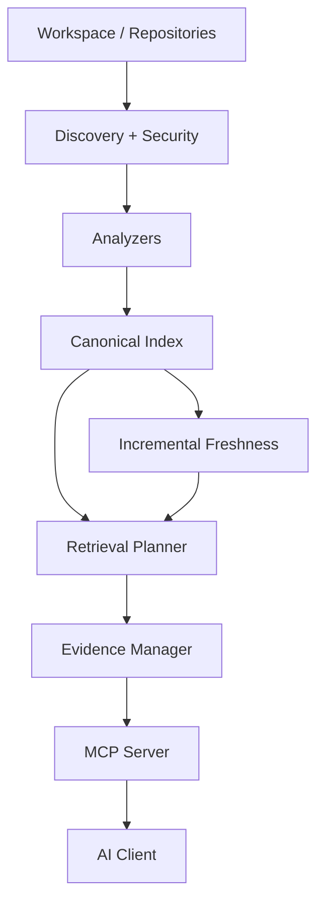

# 🗄️ Attic

**A local MCP server that gives AI coding agents persistent, evidence-backed understanding of large codebases and multi-repository workspaces.**

[](https://github.com/aman-5/attic/actions/workflows/ci.yml)
[](LICENSE-MIT)
[](rust-toolchain.toml)

Repositories on disk are always the source of truth — every index, graph, and cache Attic builds is derived and disposable.

## ✨ At a glance

- **Fast code search** — full-text search over indexed content, not a slow re-grep every turn.
- **Structural understanding** — symbols, definitions, and relationships for supported languages.
- **Incremental indexing** — a filesystem watcher keeps the index current without full rebuilds.
- **Evidence-backed context** — answers are checked against real source spans, with an explicit `INSUFFICIENT_EVIDENCE` result instead of a guess.
- **Multi-repository relationships** — cross-repo dependency resolution across a workspace of many repositories.
- **Curated project knowledge** — a `knowledge/` tier for facts that aren't obvious from source.
- **Local-first** — runs entirely on your machine; nothing leaves it unless you opt in to the (disabled-by-default) semantic layer.

## Contents

- [Quick Start](#quick-start)
- [Connect to your AI/MCP client](#connect-to-your-aimcp-client)
- [Use Attic](#use-attic)
- [MCP Tools](#mcp-tools)
- [Workspaces & Multiple Repositories](#workspaces--multiple-repositories)
- [Project Knowledge](#project-knowledge)
- [Language Support](#language-support)
- [How It Works](#how-it-works)
- [Configuration](#configuration)
- [Troubleshooting](#troubleshooting)
- [Build from Source](#build-from-source)
- [Documentation](#documentation)

## 🚀 Quick Start

No Rust, Cargo, or a native compiler required — this downloads a prebuilt
binary and verifies its checksum before installing it (no admin/sudo).

**Linux / macOS:**

```sh
git clone https://github.com/aman-5/attic
cd attic
./setup.sh
```

**Windows (PowerShell):**

```powershell
git clone https://github.com/aman-5/attic
cd attic
./setup.ps1
```

Each script detects your platform, downloads the matching release archive
and its published SHA-256 checksum over HTTPS, refuses to install if the
checksum doesn't match, and installs the binary under your user-local data
directory (no system-wide changes). It finishes by printing the exact MCP
configuration block below with your installed binary's path filled in.

Building from source is also supported and is the right choice if you're
contributing to Attic itself — see [Build from Source](#build-from-source).

## 🔌 Connect to your AI/MCP client

Attic is an MCP server: transport is **stdio**. Your AI client starts the
Attic process directly (no port, no `localhost` URL) — the first launch for
a database self-elects as a background daemon over stdio and a local
socket/named pipe; every later launch against the same database becomes a
thin relay to it, so you never manage a daemon process yourself. Attic
indexes and maintains the workspace you point it at, and the client calls
Attic's tools when it needs repository knowledge.

Add it to your client's MCP server configuration:

**Recommended (no environment variables needed):** just add the server —
Attic connects even with nothing configured, then you configure it by simply
telling your AI client:

> Configure Attic with these repositories:
> `C:\Users\<username>\projects\repo-a`
> `C:\work\repo-b`
> `D:\repos\repo-c`

The AI invokes Attic's `workspace` MCP tool; Attic validates the roots,
persists them atomically to `~/.attic/config.toml` (override the location
with `ATTIC_HOME`), indexes and watches each repository, and reloads the
same workspace automatically on every subsequent launch. Roots may live
anywhere on disk — no common parent, no symlinks, one daemon, one database.

```json
{
  "mcpServers": {
    "attic": {
      "command": "/absolute/path/to/attic-server",
      "args": [],
      "env": {}
    }
  }
}
```

**Windows example:**

```json
{
  "mcpServers": {
    "attic": {
      "command": "C:\\Users\\you\\.attic\\bin\\attic-server.exe",
      "args": [],
      "env": {
        "ATTIC_WORKSPACE_ROOT": "C:\\Users\\you\\code\\myrepo"
      }
    }
  }
}
```

**Linux/macOS example:**

```json
{
  "mcpServers": {
    "attic": {
      "command": "/home/you/.attic/bin/attic-server",
      "args": [],
      "env": {
        "ATTIC_WORKSPACE_ROOT": "/home/you/code/myrepo"
      }
    }
  }
}
```

This configuration shape is client-neutral: place the same
command/args/env into whichever MCP-server settings your client exposes
(Claude Code, Claude Desktop, or any other MCP-capable client).

## Use Attic

Once connected, just ask your AI client questions about the workspace — it
invokes Attic's MCP tools automatically. You don't need to construct MCP
JSON-RPC requests by hand. For example:

```text
"Find where authentication tokens are validated."
"Show me every implementation of PaymentProvider."
"Which repositories depend on the shared auth package?"
"If I change UserService.create(), what may be affected?"
"Explain how checkout flows from the API to persistence."
"Find the configuration controlling retry behavior."
```

On first start with `ATTIC_WORKSPACE_ROOT` set, Attic performs a one-time
synchronous index before it starts serving MCP requests — the first tool
call already sees current data — then watches the workspace for changes
(native filesystem watcher, falling back to periodic reconciliation) and
re-indexes incrementally. `search`/`file`/`repo_map` work as soon as this
initial index completes; `search` also fuses in semantic (kNN) candidates
via RRF once the optional semantic layer (on by default) has embeddings
available, but degrades gracefully to lexical-only when it doesn't.

## MCP Tools

| Tool | Purpose |
|---|---|
| `search` | Hybrid full-text + semantic search over indexed workspace content (RRF fusion) |
| `file` | Read a bounded, verified region of a file from the live workspace |
| `repo_map` | Structural overview of a repository |
| `context` | Evidence-backed answer to a natural-language question (`FAST` / `NORMAL` / `DEEP` modes) |
| `status` | Server/indexing health, watcher mode, resource-pressure advisory |
| `workspace` | Inspect and manage configured repository roots at runtime (`inspect` / `add` / `remove` / `set`), persisted to `<ATTIC_HOME>/config.toml` |
| `logging` | Toggle the persistent file log between `INFO` and `OFF` at runtime, no restart required |

Call `status` any time to check readiness: it reports whether indexing is
current (`incremental.state`), which watcher mechanism is active
(`watcher.mode`), cross-repository health, and resource pressure. Exact
tool schemas are defined once in
`crates/attic-server/src/main.rs::make_tools()` and returned via
`tools/list` — that function is the single source of truth for the tool
surface.

## Workspaces & Multiple Repositories

**Configuration precedence** (deterministic, never silently combined):

1. `ATTIC_CONFIG=<path>` — explicit multi-root config file
2. `<ATTIC_HOME>/config.toml` (default `~/.attic/config.toml`) — persistent
   workspace config, written automatically by the `workspace` MCP tool
3. `ATTIC_WORKSPACE_ROOT=<path>` — legacy single-repository convenience
4. none — UNCONFIGURED first run; configure through the `workspace` MCP tool

**Single repository (legacy):**

```sh
# .env / MCP client config
ATTIC_WORKSPACE_ROOT=/home/you/projects/my-app   # or C:\projects\my-app
```

**Multiple repositories, anywhere on disk:** a realistic workspace is
rarely one directory tree — repositories often live in unrelated
locations with no common parent, e.g.:

```text
C:\Users\<username>\projects\repo-a
C:\Users\<username>\projects\repo-b
C:\Users\<username>\projects\repo-c
```

Set `ATTIC_CONFIG` to a small config file listing each root explicitly —
no symlinks, no moving repositories under one directory, no Git
submodules, and no additional MCP entries/databases:

```text
[[repositories]]
path = "C:\Users\<username>\projects\repo-a"

[[repositories]]
path = "C:\Users\<username>\projects\repo-b"

[[repositories]]
path = "C:\Users\<username>\projects\repo-c"
```

```sh
# .env / MCP client config
ATTIC_CONFIG=/absolute/path/to/attic-workspace.conf
```

`ATTIC_CONFIG` and `ATTIC_WORKSPACE_ROOT` are mutually exclusive — set only
one. Each configured root is validated (must exist, be a directory,
canonicalize) and indexed/watched independently; a root that fails
validation is skipped (logged) rather than failing the other configured
repositories. Cross-repository dependency resolution (`attic-crossrepo`)
then runs automatically at startup across every repository currently
known to storage, resolving edges like "which repositories depend on the
shared auth package" from each repository's own manifests (`package.json`,
`pom.xml`, `go.mod`, `.gitmodules`, etc.) — arbitrary, unrelated roots work
exactly like repositories that happen to share a parent directory.

One logical workspace, one database, one coordinated writer queue, one
watcher per configured repository — but not necessarily one process. The
first `attic` launch for a given database self-elects as its **daemon**
(owns the writer, watchers, and startup recovery); every later launch
against the same database becomes a thin **relay** that splices its own
MCP stdio to the daemon over a local socket/named pipe, so multiple
windows on the same project run genuinely concurrently against one shared
live state — there is still only ever one writer. The daemon shuts down
after an idle timeout (~90s with zero connections); set `ATTIC_NO_DAEMON=1`
to force the older, stricter behavior where a second launch against the
same database simply refuses to start instead of relaying. See
[`docs/ARCHITECTURE.md`](docs/ARCHITECTURE.md#process-and-ownership-model)
for the full election/relay design. Attic still does **not** support
multiple *daemons* concurrently writing to the same database — give each
concurrently running *daemon* its own `ATTIC_HOME`.

## Project Knowledge

```text
my-project/
├── src/
├── tests/
├── docs/
└── knowledge/
    ├── architecture.md
    ├── domain.md
    ├── conventions.md
    └── ownership.md
```

Any Markdown file under `knowledge/**` in an indexed repository is treated
as curated **Project Knowledge** — Attic's highest documentation authority
tier — with no configuration change required beyond it existing on disk;
Attic's incremental watcher indexes and re-indexes it exactly like source.
Everything else (`README.md`, `docs/**`, an `ARCHITECTURE.md` outside
`knowledge/`) is ordinary documentation: still fully searchable, just not
elevated to the same authority.

Put in `knowledge/`: architecture intent, domain terminology, ownership,
conventions, deployment assumptions, decisions not obvious from source.
Never put in `knowledge/`: secrets, API keys, or transient chat
instructions — knowledge files are indexed and served through the same
tools as source code.

This is optional — a repository with no `knowledge/` directory works the
same, just without that top evidence tier. See `knowledge/README.md` in
this repository for a ready-to-copy template.

## Language Support

| Input | Analyzer | Result |
|---|---|---|
| Any text file | `GenericAnalyzer` | Full-text search, no symbols |
| Java / Python / Go / JavaScript / TypeScript (incl. `.tsx`) | Structural (hand-written tree-sitter) | Full symbols, definitions, imports, relationships |
| C / C++ / Ruby / C# / Scala / PHP / Swift / Lua / Rust / Dockerfile | Structural (generic tags.scm) | Symbol definitions + intra-file references only — no import/relationship resolution (honestly declared, not overclaimed) |
| JSON | `JsonAnalyzer` | Canonical subtree chunks with JSON-pointer addressing (cross-environment dedup) |
| Adobe Experience Manager (AEM) | `aem` platform plugin | JCR content (`.content.xml`, `*.xml` under `jcr_root/`): path-qualified JCR nodes with `jcr:primaryType`, `sling:resourceType`/`resourceSuperType`, `cq:template`; HTL (`*.html` under `jcr_root/`, `*.htl`): `data-sly-template` definitions and `data-sly-use`/`include`/`resource` targets; OSGi configs (`*.cfg.json`, Felix `*.config`): PID, factory name, run modes, properties; clientlib `js.txt`/`css.txt` sources. Imports only — no cross-file resolution |
| Everything else (Kotlin, etc.) | `GenericAnalyzer` (today) | Full-text search; a dedicated analyzer can be added as a plugin |

Rich language support is additive, not a gate on usability — every
text-based file in your workspace is searchable from the first index,
regardless of language.

Each language or platform is an **analyzer plugin**
(`attic_analyzers::AnalyzerPlugin`): it declares which paths it claims and
registers its analyzers. Plugins are enabled or disabled in `attic.toml`
(`[indexing] analyzers` / `disabled_analyzers`, by id: `aem`, `java`,
`python`, `go`, `javascript`, `typescript`, `json`, `c`, `cpp`, `ruby`,
`csharp`, `scala`, `php`, `swift`, `lua`, `rust`, `dockerfile`). A disabled
plugin's files are still indexed lexically. Adding a language means writing
one plugin and adding it to `PluginCatalog` — indexing, storage and the
server need no changes. Path matching is separator- and case-insensitive,
so plugins behave identically on Windows, macOS and Linux.

## 🏗️ How It Works


```mermaid
flowchart TD
    A[Workspace / Repositories] --> B[Discovery + Security]
    B --> C[Analyzers]
    C --> D[Canonical Index]
    D --> E[Incremental Freshness]
    D --> F[Retrieval Planner]
    E --> F
    F --> G[Evidence Manager]
    G --> H[MCP Server]
    H --> I[AI Client]
```

Repositories on disk are always the source of truth; every index, graph,
and cache is derived and disposable. See
[`docs/ARCHITECTURE.md`](docs/ARCHITECTURE.md) for the full pipeline,
retrieval/evidence model, incremental-recovery behavior, and
cross-repository diagrams.

## ⚙️ Configuration

All configuration is via environment variables — there are no CLI flags.

<details>
<summary><strong>Full environment variable reference</strong> (click to expand)</summary>

| Variable | Purpose |
|---|---|
| `ATTIC_WORKSPACE_ROOT` | Single repository root to index and watch. Omit to start UNCONFIGURED (no `~/.attic/config.toml`) or resume from persistent config. Mutually exclusive with `ATTIC_CONFIG`. |
| `ATTIC_CONFIG` | Path to a workspace config file listing multiple `[[repositories]]` roots (arbitrary locations, no common parent required). Mutually exclusive with `ATTIC_WORKSPACE_ROOT`. See [Workspaces & Multiple Repositories](#workspaces--multiple-repositories). |
| `ATTIC_HOME` | Overrides the Attic application home directory (default: `~/.attic`). Config, database, and runtime state all derive from this location. An empty `ATTIC_HOME` is a startup error — unset it or provide a valid path. |
| `ATTIC_DB_PATH` | Legacy single-variable override; the data dir is derived from its parent. |
| `ATTIC_SEMANTIC` | Semantic retrieval is enabled by default; set to `0` to disable it — see [Semantic search](#semantic-search-optional). |
| `ATTIC_MODEL_CACHE_DIR` | Directory `Qwen3Embedder` downloads/caches model files into (default: alongside the database, in a `models` subdirectory). Point this at a pre-populated cache for offline/airgapped use — see [Semantic search](#semantic-search-optional). |
| `ATTIC_LOG` / `RUST_LOG` | Log verbosity (`tracing`'s `EnvFilter` syntax); defaults to `info`. `ATTIC_LOG` takes precedence when both are set. |
| `ATTIC_RESOURCE_MODE` | Force `low` / `balanced` / `performance` resource tuning instead of hardware-detected `auto` (see `attic.toml`'s `[resources]` table for the same override, and the `status` tool's `resource_mode_source` field). |
| `ATTIC_TOTAL_MEMORY_BUDGET_MIB` | Total memory budget enforced by the resource monitor. |
| `ATTIC_MAX_FOREGROUND_QUERIES` | Concurrent foreground MCP query cap. |
| `ATTIC_MIN_FREE_MEMORY_MIB` / `ATTIC_MAX_IO_OPS_PER_SEC` | Additional resource-pressure tuning — see `crates/attic-storage/src/resource_policy.rs`. |
| `ATTIC_WRITER_BATCH_SIZE` / `ATTIC_WRITER_FLUSH_INTERVAL_MS` / `ATTIC_WRITER_QUEUE_CAPACITY` | Writer-queue tuning for indexing throughput. |
| `ATTIC_SCHEDULER_WORKERS` | Concurrent incremental reindex tasks / bootstrapped repositories (same as `[resources] scheduler_workers`). |
| `ATTIC_EMBEDDING_BATCH_SIZE` / `ATTIC_EMBEDDING_WORKERS` | Items per embedding call and concurrent embedding workers (same as `[resources] embedding_batch_size` / `embedding_worker_count`). |
| `ATTIC_INCREMENTAL_TASK_QUEUE_CAPACITY` / `ATTIC_RECONCILIATION_TASK_QUEUE_CAPACITY` | Maximum pending incremental / reconciliation task-queue depth. |
| `ATTIC_MAX_GRAPH_DEPTH` / `ATTIC_MAX_GRAPH_NODES` | Bounds on graph traversal depth/breadth during evidence expansion. |
| `ATTIC_MAX_CONTEXT_TOKENS` | Maximum tokens consumed by context building for a single `context` query (default `8192`). |
| `ATTIC_DEFAULT_TASK_TIMEOUT_MS` | Default timeout for background tasks; tasks exceeding it are cancelled and rescheduled. |
| `ATTIC_BACKUP_RELATIVE_DIR` / `ATTIC_MAX_BACKUP_RETAIN` | Crash-recovery backup directory (relative to the database path) and how many checkpoints to retain (REC-B2, default 3). |
| `ATTIC_CHECKPOINT_WAL_FRAMES` / `ATTIC_CHECKPOINT_MINUTES` / `ATTIC_WAL_AUTOCKPT_ENABLED` | WAL checkpoint interval (by frame count or elapsed time, whichever comes first) and whether auto-checkpointing is enabled. |
| `ATTIC_GRACEFUL_SHUTDOWN_TIMEOUT_MS` | How long the server waits for in-flight tasks to complete on shutdown before force-exiting. |
| `ATTIC_STARTUP_INTEGRITY_CHECK` / `ATTIC_STARTUP_FOREIGN_KEY_CHECK` | Whether the database integrity check / foreign-key check runs at startup (see Crash recovery in `docs/ARCHITECTURE.md`). |
| `ATTIC_NO_DAEMON` | Set to `1` to disable the daemon/relay architecture and force the older single-process behavior, where a second launch against the same database refuses to start instead of relaying (see [Workspaces & Multiple Repositories](#workspaces--multiple-repositories)). |

Home resolution: `ATTIC_HOME` (if set and non-empty) → `~/.attic` (derived
from the OS user home directory). Setting `ATTIC_HOME` to an empty string is
a startup error — unset it or provide a valid path. `ATTIC_DB_PATH` is
supported as an explicit database path override for advanced/testing use.
Attic never writes into your workspace — all index state is stored under the
Attic home directory.

Resource variables fail closed: a set but unparsable value (for example
`ATTIC_WRITER_BATCH_SIZE=abc` or `ATTIC_RESOURCE_MODE=fast`) stops startup
with an error naming the variable, instead of being silently ignored. Empty
values are treated as unset.

</details>

### Semantic search (optional)

Enabled by default (`ATTIC_SEMANTIC=0` to disable). When enabled, `search`
and `context` are backed by `Qwen3Embedder` — a real, Candle-backed neural
embedder (`Qwen/Qwen3-Embedding-0.6B`) — by default; `HashingEmbedder`, a
deterministic feature-hashing baseline, serves strictly as an offline
test double. Canonical (lexical/structural)
retrieval never depends on either. The `status` tool reports semantic subsystem
state (`embedding_recommendation`, `semantic_health`, queue progress, and background
diagnostics). Vector space compatibility is strictly governed by embedding
fingerprints and semantic generations.

**Offline / airgapped machines:** `Qwen3Embedder` downloads `Qwen/Qwen3-Embedding-0.6B`
from Hugging Face on first use and caches it — no network access is
needed on subsequent runs. To use it on a machine without network access,
pre-populate the cache on a machine that does, then copy that cache directory
over and point `ATTIC_MODEL_CACHE_DIR` at it.

### `attic.toml` (resource, semantic, indexing and analyzer tuning)

A second, optional file living alongside `<ATTIC_HOME>/config.toml` (which
keeps its existing `[[repositories]]` workspace-membership role, untouched).
A fresh install writes a fully commented template. Precedence is
environment variable > `attic.toml` > hardware-detected default, and every
resource value is validated and then clamped to what the machine supports.
Unknown tables or keys, zero sizes, empty patterns and unknown analyzer ids
fail startup with an actionable error.

```toml
[resources]
mode = "auto"  # or "low" / "balanced" / "performance" to force a tier

# Optional overrides — uncomment to override automatic tuning.
# total_memory_budget_mib = 4096
# min_free_memory_mib = 400
# max_foreground_queries = 64
# writer_batch_size = 256
# writer_flush_interval_ms = 50
# writer_queue_capacity = 512
# max_io_ops_per_sec = 200
# scheduler_workers = 4          # concurrent reindex tasks / repositories
# embedding_batch_size = 16      # items per embedding call
# embedding_worker_count = 1     # serialized providers still run one lane

[semantic]
enabled = true
model = "qwen3-embedding-0.6b"
# max_file_bytes = 262144
# exclude_globs = ["*-Code.json", "fixtures/"]

[indexing]
# exclude = ["**/pom.xml"]
# structural = true              # false = lexical-only kill-switch
# max_units_per_file = 100000    # fail-closed per-file ceiling
# analysis_threads = 0           # 0 = logical CPUs minus two
# analyzers = ["java", "typescript", "aem"]   # empty = every plugin
# disabled_analyzers = ["php"]
```

Absent, the file defaults to `mode = "auto"` (hardware-detected), the
production semantic engine and every analyzer plugin. SQLite `cache`/`mmap`
sizing stays mode-derived. With the neural provider, `embedding_batch_size`
defaults to at most 16 to bound memory; an explicit value is honoured and
still bounded by the provider's token budget.

## 🛠️ Troubleshooting

<details>
<summary><strong>Common issues and what to check</strong> (click to expand)</summary>

- **Server exits immediately on startup**: check stderr for a fail-closed
  message — usually a corrupted database (try a fresh `ATTIC_HOME` to
  isolate) or a workspace bootstrap failure (bad permissions, path doesn't
  exist).
- **`status` reports degraded cross-repo state**: cross-repository
  resolution hasn't completed yet or failed; single-repo retrieval is
  unaffected.
- **High memory / "server busy" errors**: Attic is enforcing its
  configured resource budget — raise `ATTIC_TOTAL_MEMORY_BUDGET_MIB` /
  `ATTIC_MAX_FOREGROUND_QUERIES` or reduce concurrently indexed repos.
- **Stale results after external changes**: Attic reconciles on startup;
  to force a fresh index, stop Attic and remove `attic.db*` from the data
  directory.
- **`setup.sh`/`setup.ps1` fails to download or fails checksum
  verification**: this means either no matching release exists yet for
  your platform, or the download was corrupted/tampered with — the script
  refuses to install either way. Build from source instead (below).

See `docs/PLAYBOOK.md` for a fuller troubleshooting table and recovery
procedures.

</details>

## 🔧 Build from Source

This is the **contributor path** — normal users should use
[Quick Start](#quick-start) above instead.

```sh
git clone https://github.com/aman-5/attic
cd attic
cargo build --release --package attic-server
# binary at target/release/attic (target\release\attic.exe on Windows)
```

Requires:

- **Rust** — pinned in `rust-toolchain.toml` (currently `1.98.0`,
  MSRV `1.89`); `rustup show` in the repo root installs it automatically.
- **A linker for your platform**:
  - **Windows (recommended)**: Microsoft "Build Tools for Visual Studio"
    with the C++ build tools workload. The GPU build
    (`--features ort-directml`) **requires MSVC** — ONNX Runtime ships
    MSVC-only prebuilt binaries, so build with
    `cargo build --release --package attic-server --target x86_64-pc-windows-msvc --features ort-directml`.
  - **Windows (no MSVC)**: GNU/MinGW via [Scoop](https://scoop.sh)
    (`scoop install mingw`) — CPU-only build; see `docs/PLAYBOOK.md`
    (Development).
  - **Linux**: system `cc`/`clang` (e.g. `build-essential` on
    Debian/Ubuntu) — tree-sitter grammars build bundled C sources via `cc`.
  - **macOS**: `xcode-select --install` (Command Line Tools).

### Semantic engine notes

- **Isolated inference worker** — neural embedding runs in a supervised
  child process (`attic inference-worker`, spawned automatically; not a
  user-facing command). A hung or crashed model runtime is killed and
  restarted without touching the MCP server.
- **GPU (Windows)**: with the `ort-directml` build, set
  `ATTIC_ONNX_MODEL_DIR` to a directory containing `model_fp16.onnx` +
  `tokenizer.json` (onnx-community Qwen3-Embedding-0.6B fp16 export).
  Without it, the verified CPU provider is used. `status` reports which
  backend/quantization is actually serving under `semantic_identity`.
- **CPU model cache**: the Qwen3 safetensors download in the background on
  first run (canonical indexing never waits), are verified against pinned
  SHA-256, and a corrupt cache is quarantined, never silently loaded.
- **Unsupported documents**: PDF and DOCX are reported as
  `unsupported document format` in diagnostics rather than parsed.
- `[indexing] max_units_per_file` in `attic.toml` is a fail-closed ceiling
  (default 100000) — a file exceeding it aborts the indexing run rather
  than publishing silently truncated content.

```sh
cargo test -p <crate>                                 # focused test
cargo test --workspace                                # full suite
cargo fmt --all && cargo clippy --workspace --all-targets -- -D warnings
```

See `docs/PLAYBOOK.md` (Development, Maintenance) for the full developer
workflow: schema migrations, adding an analyzer, and the release process
(`tools/package.sh`, which is what CI runs to produce the archives
`setup.sh`/`setup.ps1` download).

## 📚 Documentation

| Doc | Covers |
|---|---|
| [`docs/ARCHITECTURE.md`](docs/ARCHITECTURE.md) | Visual system design: pipeline, ownership model, storage concurrency, security, crash recovery. |
| [`docs/PLAYBOOK.md`](docs/PLAYBOOK.md) | Operations manual: install, connect, troubleshoot, recover, update, and develop. |
| [`docs/TIMING-R16.md`](docs/TIMING-R16.md) | Measured indexing/embedding timings from the acceptance machine. |
