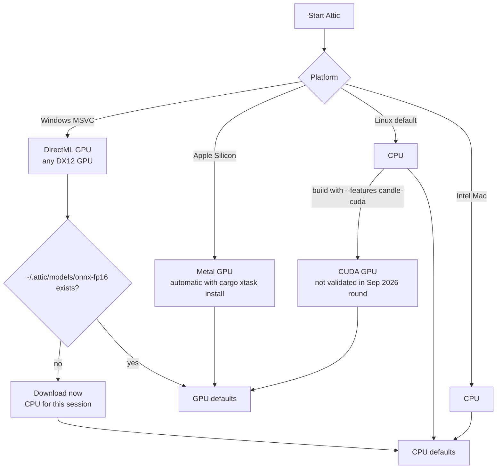
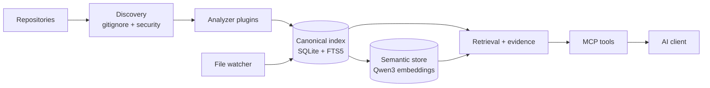
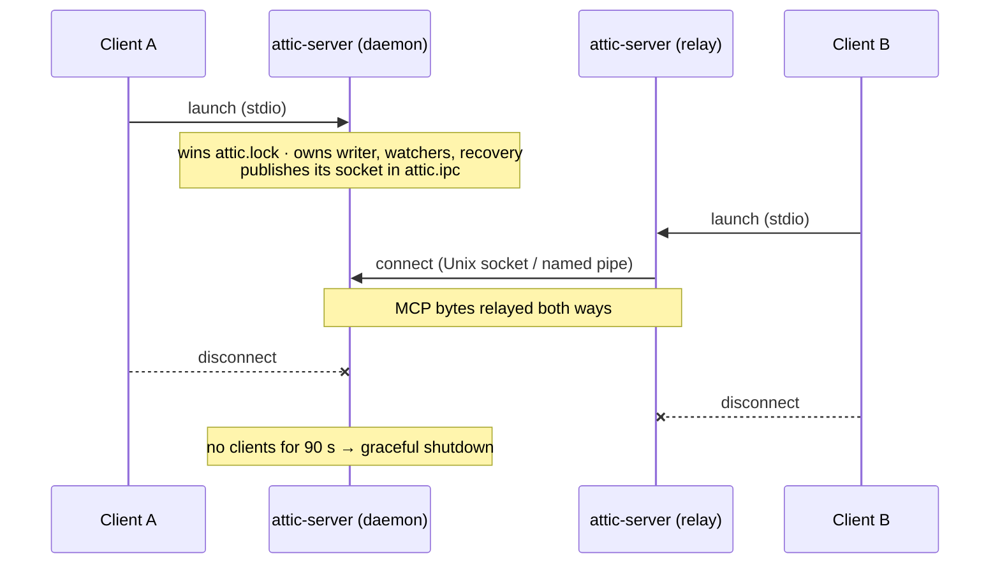

# 🗄️ Attic

**A local MCP server that gives AI coding agents fast, evidence-backed
understanding of any codebase — Python, Java/Spring, Kotlin,
JavaScript/TypeScript, Go, AEM and more — across one repository or many.**

[](https://github.com/aman-5/attic/actions/workflows/ci.yml)
[](LICENSE-MIT)
[](rust-toolchain.toml)

Your repositories on disk are always the source of truth. Every index, graph
and embedding Attic builds is derived, local and disposable — and Attic never
writes into your projects.

## What you get

| | |
|---|---|
| 🔎 **Hybrid search** | Full-text search fused with local semantic embeddings: exact identifiers *and* "where do we retry failed payments?" |
| 🧬 **Code structure** | Symbols, definitions, imports and call/inheritance relationships for Java, Python, Go, JS/TS and 11 more languages |
| ⚡ **Always current** | A file watcher re-indexes only what changed, seconds after you save |
| ✅ **Evidence, not guesses** | `context` answers cite verified source spans — or say `INSUFFICIENT_EVIDENCE` |
| 🕸️ **Many repositories** | One workspace spanning unrelated folders, with cross-repo dependency edges from Maven, Gradle, npm, Go, Python, OSGi, AEM and git submodules |
| 📚 **Project knowledge** | Curated `knowledge/*.md` files become top-authority evidence |
| 🔒 **Local-first** | Code never leaves your machine. The only network access is the one-time embedding-model download (`ATTIC_SEMANTIC=0` turns it off) |

## Contents

- [Quick start](#quick-start) — install, connect, index
- [Pick your stack](#pick-your-stack) — Python · Java/Spring/Kotlin · JS/TS · Go · AEM · everything else
- [Ask questions](#ask-questions) · [Semantic backend & performance](#semantic-backend--performance) · [MCP tools](#mcp-tools)
- [How it works](#how-it-works) · [Workspaces](#workspaces)
- [Configuration](#configuration) — files, `attic.toml`, environment variables
- [Languages & analyzer plugins](#languages--analyzer-plugins)
- [Troubleshooting](#troubleshooting) · [Build from source](#build-from-source) · [Documentation](#documentation)

## Quick start

### 1 · Install

<details open>
<summary><b>macOS / Linux</b></summary>

```sh
git clone https://github.com/aman-5/attic
cd attic
./setup.sh
```

</details>

<details>
<summary><b>Windows (PowerShell)</b></summary>

```powershell
git clone https://github.com/aman-5/attic
cd attic
./setup.ps1
```

</details>

The script downloads the prebuilt binary for your platform, refuses to install
it unless its published SHA-256 checksum matches, installs it as
`~/.attic/attic-server` (`attic-server.exe` on Windows) without admin rights,
and prints the MCP configuration with the real path filled in. No Rust
toolchain needed — or [build it yourself](#build-from-source).

### 2 · Connect your AI client

Attic speaks MCP over **stdio**: your client launches it — there is no port or
URL to manage. Pick your client:

<details>
<summary><b>Claude Desktop</b></summary>

Add to `claude_desktop_config.json`:

```json
{
  "mcpServers": {
    "attic": { "command": "/Users/you/.attic/attic-server" }
  }
}
```

</details>

<details>
<summary><b>Claude Code</b></summary>

```sh
claude mcp add attic -- ~/.attic/attic-server
```

Or commit a project-level `.mcp.json` with the same `mcpServers` block as
Claude Desktop.

</details>

<details>
<summary><b>VS Code (GitHub Copilot agent mode)</b></summary>

Add to `.vscode/mcp.json` (or your user MCP configuration):

```json
{
  "servers": {
    "attic": {
      "type": "stdio",
      "command": "C:\\Users\\you\\.attic\\attic-server.exe"
    }
  }
}
```

</details>

<details>
<summary><b>Cursor</b></summary>

Add to `~/.cursor/mcp.json` (all projects) or `.cursor/mcp.json` (one
project) — the same `mcpServers` block as Claude Desktop.

</details>

<details>
<summary><b>Any other MCP client</b></summary>

- **command**: absolute path to `attic-server` (`attic-server.exe` on Windows)
- **args**: none
- **transport**: stdio
- **env** *(optional)*: any variable from the
  [environment reference](#environment-variables), e.g.
  `"ATTIC_WORKSPACE_ROOT": "/path/to/repo"`

</details>

### 3 · Tell your AI what to index

> Configure Attic with these repositories: `~/code/orders-service`,
> `~/code/web-app`, `D:\work\shared-libs`

The client calls Attic's `workspace` tool. Attic validates each root, indexes
it, starts watching it and remembers the workspace (in `~/.attic/config.toml`)
across restarts. Roots can live anywhere — no common parent, no symlinks.
Ask *"What's Attic's status?"* at any time to see progress.

Prefer configuration to conversation? Set `ATTIC_WORKSPACE_ROOT` (one
repository) or `ATTIC_CONFIG` (a list) in the client's `env` block — see
[Workspaces](#workspaces).

## Pick your stack

Every text file is searchable from the first index. Languages with an analyzer
plugin also get symbols and relationships. Dependency and build-output folders
(`node_modules/`, `target/`, `build/`, `dist/`, `out/`, `.venv/`, `venv/`,
`__pycache__/`, `.gradle/`, `.next/`, `coverage/`, …) and everything in
`.gitignore` are skipped automatically.

<details>
<summary><b>🐍 Python</b> — Django, FastAPI, Flask, data/ML</summary>

- **Understands:** modules, classes, functions and methods, imports, calls.
- **Cross-repo edges:** `pyproject.toml` and `requirements*.txt` dependencies
  between your own packages.
- **Also skipped by default:** `.pytest_cache/`, `.tox/`, `env/`.
- **Try:** *"Where is the Celery retry policy configured?"* ·
  *"What calls `charge_card`?"*

```toml
# ~/.attic/attic.toml (optional)
[indexing]
exclude = ["**/migrations/versions/**", "notebooks/**"]
```

</details>

<details>
<summary><b>☕ Java / Spring / Kotlin</b> — Spring Boot, Maven, Gradle</summary>

- **Understands:** Java classes, interfaces, methods, fields, imports,
  inheritance and calls; Kotlin classes, objects, companions, functions and
  type aliases.
- **Cross-repo edges:** `pom.xml`, `build.gradle(.kts)` and
  `settings.gradle(.kts)` — *"which services depend on `common-auth`?"*
- **Try:** *"Show every implementation of `PaymentGateway`"* ·
  *"Which controller handles `/orders/{id}`?"* ·
  *"If I change `OrderService.create`, what may break?"*

```toml
# ~/.attic/attic.toml (optional)
[indexing]
exclude = ["**/generated-sources/**"]
```

</details>

<details>
<summary><b>🟨 JavaScript / TypeScript</b> — Node, React, Next.js, Angular</summary>

- **Understands:** functions, classes, exports, ESM imports and `require`,
  calls — including JSX/TSX.
- **Cross-repo edges:** `package.json` dependencies, including workspaces.
- **Try:** *"Where is the auth token refreshed?"* ·
  *"Which components use `useCart`?"*

```toml
# ~/.attic/attic.toml (optional)
[indexing]
exclude = ["**/*.min.js", "public/vendor/**"]
[semantic]
exclude_globs = ["**/__snapshots__/**"]
```

</details>

<details>
<summary><b>🐹 Go</b></summary>

- **Understands:** packages, functions, methods, types, module imports, calls.
- **Cross-repo edges:** `go.mod` `require`/`replace` between your modules.
- **Try:** *"Where is the gRPC server started?"* ·
  *"Which modules import `internal/billing`?"*

</details>

<details>
<summary><b>🧱 Adobe Experience Manager (AEM)</b></summary>

- **Understands:** JCR content (`.content.xml`, `*.xml` under `jcr_root/`)
  with resource types, super types and templates; HTL templates and
  `data-sly-use`/`include`/`resource` targets; OSGi configurations (PIDs, run
  modes, properties); clientlib manifests. Plain HTML/XML/JSON outside AEM
  layouts is left to the regular analyzers.
- **Cross-repo edges:** OSGi `MANIFEST.MF` bundles and exported/imported
  packages; component `sling:resourceSuperType` inheritance.
- **Try:** *"Which components extend `core/wcm/components/text`?"* ·
  *"What OSGi config sets the payment endpoint on publish?"*

</details>

<details>
<summary><b>🧩 Everything else</b></summary>

- **Symbols:** C, C++, C#, Ruby, PHP, Scala, Swift, Lua, Rust, Dockerfile.
- **JSON:** canonical subtree chunks with JSON-pointer addresses, so
  near-identical environment exports are stored and searched once.
- **Any other text** (YAML, SQL, Markdown, shell, …): full-text and semantic
  search.
- Missing a language? See
  [Languages & analyzer plugins](#languages--analyzer-plugins).

</details>

## Ask questions

Just talk to your AI client — it calls Attic's tools for you:

```text
"Find where authentication tokens are validated."
"Show me every implementation of PaymentProvider."
"Which repositories depend on the shared auth package?"
"If I change UserService.create(), what may be affected?"
"Explain how checkout flows from the API to persistence."
"Find the configuration controlling retry behaviour."
```

Search and `file` work as soon as the first index finishes (seconds for most
repositories). Semantic results join in automatically while embeddings are
generated in the background; until then search is purely lexical.

## Semantic backend & performance

Semantic search is enabled by default and runs locally. The model is downloaded
once into `~/.attic/models` (never `~/.cache/huggingface`). On first start with
no cached fp16 ONNX model, Attic downloads in the background and embeds that
session on CPU; the GPU backend is used from the next start.


```mermaid
flowchart TD
    A[Start Attic] --> B{Platform}
    B -->|Windows MSVC| W[DirectML GPU<br/>any DX12 GPU]
    B -->|Apple Silicon| M[Metal GPU<br/>automatic with cargo xtask install]
    B -->|Linux default| L[CPU]
    L -->|build with --features candle-cuda| C[CUDA GPU<br/>not validated in Sep 2026 round]
    B -->|Intel Mac| I[CPU]
    W --> D{~/.attic/models/onnx-fp16 exists?}
    D -->|no| F[Download now<br/>CPU for this session]
    D -->|yes| G[GPU defaults]
    M --> G
    C --> G
    F --> CPU[CPU defaults]
    L --> CPU
    I --> CPU
```

| Default | GPU (DirectML / Metal / CUDA) | CPU |
|---|---:|---:|
| `min_score` | `0.0` | `0.30` |
| `max_units_per_repo` | `100000` | `2560` |
| `max_file_bytes` | `8388608` (8 MiB) | `262144` (256 KiB) |
| `max_units_total` | `100000` | `100000` |

> [!TIP]
> Measured on an RTX A500 Laptop GPU, DirectML fp16 ONNX reaches about
> **5,600–6,000 padded tokens/s**. Chunks/s varies with chunk size: Attic's own
> small chunks measured **76–89 chunks/s**, while larger AEM chunks measured
> **6.22–13.7 chunks/s**. See [`docs/PERFORMANCE.md`](docs/PERFORMANCE.md).

## MCP tools

| Tool | What it does |
|---|---|
| `search` | Hybrid search: full-text (FTS5 syntax) fused with semantic nearest neighbours |
| `context` | Evidence-backed answer to a question, with verified claims — `FAST` / `NORMAL` / `DEEP` |
| `file` | A bounded, secret-scanned region of a live file (line or byte range) |
| `repo_map` | Structure and statistics of one repository |
| `status` | Readiness, indexing/watcher state, semantic progress, resource pressure |
| `workspace` | `inspect` / `add` / `remove` / `set` repository roots at runtime (persisted) |
| `logging` | Turn the file log on or off instantly, no restart |
| `debug_drain_task` | Admin: run one pending incremental task synchronously |

The exact schemas come from `make_tools()` in `crates/attic-server/src/main.rs`
and are returned by `tools/list`.

## How it works


```mermaid
flowchart LR
    R[Repositories] --> D[Discovery<br/>gitignore + security]
    D --> A[Analyzer plugins]
    A --> I[(Canonical index<br/>SQLite + FTS5)]
    I --> S[(Semantic store<br/>Qwen3 embeddings)]
    W[File watcher] --> I
    I --> Q[Retrieval + evidence]
    S --> Q
    Q --> M[MCP tools] --> C[AI client]
```

**One process model.** The first Attic launch for a database becomes the
**daemon**: it owns the single database writer, the watchers and crash
recovery. Every later launch (another IDE window, another agent) becomes a thin
**relay** that forwards its stdio to the daemon. If the daemon dies, a relay
takes over transparently.


```mermaid
sequenceDiagram
    participant A as Client A
    participant D as attic-server (daemon)
    participant R as attic-server (relay)
    participant B as Client B
    A->>D: launch (stdio)
    Note over D: wins attic.lock · owns writer, watchers, recovery<br/>publishes its socket in attic.ipc
    B->>R: launch (stdio)
    R->>D: connect (Unix socket / named pipe)
    Note over R,D: MCP bytes relayed both ways
    A--xD: disconnect
    B--xR: disconnect
    Note over D: no clients for 90 s → graceful shutdown
```

See [`docs/ARCHITECTURE.md`](docs/ARCHITECTURE.md) for the full design.

## Workspaces

A workspace is a set of repository roots anywhere on disk. It is resolved in
this order (sources are never mixed):

| # | Source | Use it for |
|---|---|---|
| 1 | `ATTIC_CONFIG=<file>` | A checked-in or shared list of repositories |
| 2 | `<ATTIC_HOME>/config.toml` | The default — written by the `workspace` tool, survives restarts |
| 3 | `ATTIC_WORKSPACE_ROOT=<dir>` | One repository, configured from the MCP client's `env` |
| 4 | *(none)* | First run: Attic starts unconfigured and waits for the `workspace` tool |

`ATTIC_CONFIG` and `ATTIC_WORKSPACE_ROOT` are mutually exclusive. Both config
files use the same small format:

```toml
[[repositories]]
path = "/home/you/code/orders-service"

[[repositories]]
path = "D:\work\shared-libs"
```

Each root is validated and indexed independently: a missing or unreadable root
is reported by `status` and skipped, never blocking the others. A directory
containing several git repositories is split into one repository per nested
`.git`. Cross-repository edges are resolved across the configured members only.

## Configuration

Attic works with zero configuration. Everything below is optional.

### Where things live

Everything is under `ATTIC_HOME` (default `~/.attic`) — never inside your
repositories and never in Hugging Face's global `~/.cache/huggingface` cache:

| Path | Contents |
|---|---|
| `attic.db` (+ `-wal`, `-shm`) | Canonical index — disposable, rebuilt from source |
| `semantic.db` | Embeddings — disposable |
| `config.toml` | Workspace membership (`[[repositories]]`) |
| `attic.toml` | Tunables (below); a commented template is written on first run |
| `models/` | Embedding model cache under `ATTIC_HOME`; created only when model assets are downloaded |
| `logs/` | Daily file log — off by default, created only after `logging {"action":"on"}` |
| `backups/` | Crash-recovery backups (last 3), created only when the shutdown backup first runs |
| `attic.lock`, `attic.ipc` | Daemon election and relay address |

### `attic.toml`

Precedence is **environment variable › `attic.toml` › automatic default**.
Every resource value is validated and then clamped to what the machine can
support; unknown keys, zero sizes and unknown analyzer ids stop startup with a
clear error. Restart Attic after editing.

<details>
<summary><b>Full <code>attic.toml</code> reference</b></summary>

**`[resources]`** — defaults depend on the automatically selected mode
(low / balanced / performance):

| Key | Default | Effect |
|---|---|---|
| `mode` | `"auto"` | `auto` picks a tier from RAM/CPU; or force `"low"`, `"balanced"`, `"performance"` |
| `total_memory_budget_mib` | 2048 / 4096 / 8192 | Memory budget enforced by the resource monitor |
| `min_free_memory_mib` | 256 / 400 / 400 | Background work pauses below this much free memory |
| `max_foreground_queries` | 32 / 64 / 128 | Concurrent MCP requests |
| `scheduler_workers` | 2 / 2 / 8 | Concurrent incremental re-index tasks and repository bootstraps |
| `embedding_batch_size` | 8 / 16 / 64 | Items per embedding call (capped at 16 while semantic is on, unless set explicitly) |
| `embedding_worker_count` | 1 / 3 / 8 | Embedding workers (a provider that serializes still runs one lane) |
| `writer_batch_size` | 128 / 256 / 512 | Mutations per database transaction |
| `writer_flush_interval_ms` | 100 / 50 / 25 | Maximum delay before a partial batch commits |
| `writer_queue_capacity` | 256 / 512 / 1024 | Pending mutations before back-pressure |
| `max_io_ops_per_sec` | 100 / 200 / 400 | Commit rate limit |

**`[semantic]`**

Explicit values override the backend-specific automatic defaults. Attic logs
`semantic selection defaults` at startup with the resolved values.

| Key | Default | Effect |
|---|---|---|
| `enabled` | `true` | `false` keeps search lexical-only and never downloads the model |
| `model` | `"qwen3-embedding-0.6b"` | The supported embedding model |
| `dimension` | native (1024) | Smaller vectors (e.g. `512`) use less disk and RAM; changing it re-embeds |
| `min_score` | GPU `0.0` / CPU `0.30` | Minimum selection score to embed a unit; 0.0 embeds every eligible unit |
| `max_units_per_repo` | GPU `100000` / CPU `2560` | Embedding cap per repository |
| `max_file_bytes` | GPU `8388608` (8 MiB) / CPU `262144` (256 KiB) | Larger files are searchable but never embedded |
| `max_units_total` | `100000` | Whole-workspace embedding cap |
| `exclude_globs` | `[]` | Paths never embedded, e.g. `["**/*.min.js", "testdata/"]` |

**`[indexing]`**

| Key | Default | Effect |
|---|---|---|
| `exclude` | `[]` | Extra glob patterns to skip, on top of `.gitignore` and built-in defaults |
| `structural` | `true` | `false` = lexical-only indexing (kill-switch) |
| `max_units_per_file` | `100000` | Fail-closed per-file ceiling: exceeding it aborts the run instead of truncating |
| `analysis_threads` | `0` | Per-file analysis threads; `0` = logical CPUs minus two |
| `analyzers` | `[]` | Enable only these plugins (empty = all) |
| `disabled_analyzers` | `[]` | Disable plugins; their files stay searchable |

</details>

### Environment variables

<details>
<summary><b>Full environment variable reference</b></summary>

**Workspace and paths**

| Variable | Effect |
|---|---|
| `ATTIC_HOME` | Attic's home directory (default `~/.attic`); empty is an error |
| `ATTIC_DB_PATH` | Explicit database file; its folder becomes the home when `ATTIC_HOME` is unset |
| `ATTIC_CONFIG` | Workspace config file listing `[[repositories]]` |
| `ATTIC_WORKSPACE_ROOT` | Single repository root (not persisted) |

**Semantic layer**

| Variable | Effect |
|---|---|
| `ATTIC_SEMANTIC` | `0` disables semantic search (default: on) |
| `ATTIC_ONNX_MODEL_DIR` | GPU build only: directory with `model_fp16.onnx` + `tokenizer.json` |
| `ATTIC_VRAM_CEILING_MIB` | GPU build only: VRAM budget override |

**Resources** — same meaning as the `attic.toml` keys:

| Variable | `attic.toml` key |
|---|---|
| `ATTIC_RESOURCE_MODE` | `mode` |
| `ATTIC_TOTAL_MEMORY_BUDGET_MIB` | `total_memory_budget_mib` |
| `ATTIC_MIN_FREE_MEMORY_MIB` | `min_free_memory_mib` |
| `ATTIC_MAX_FOREGROUND_QUERIES` | `max_foreground_queries` |
| `ATTIC_SCHEDULER_WORKERS` | `scheduler_workers` |
| `ATTIC_EMBEDDING_BATCH_SIZE` | `embedding_batch_size` |
| `ATTIC_EMBEDDING_WORKERS` | `embedding_worker_count` |
| `ATTIC_WRITER_BATCH_SIZE` | `writer_batch_size` |
| `ATTIC_WRITER_FLUSH_INTERVAL_MS` | `writer_flush_interval_ms` |
| `ATTIC_WRITER_QUEUE_CAPACITY` | `writer_queue_capacity` |
| `ATTIC_MAX_IO_OPS_PER_SEC` | `max_io_ops_per_sec` |
| `ATTIC_MAX_BACKGROUND_WORKERS` | *(env only)* background admission slots |
| `ATTIC_PER_REPO_MEMORY_BUDGET_MIB` | *(env only)* per-repository memory budget (default 512) |

Resource variables **fail closed**: a set but unparsable value (for example
`ATTIC_WRITER_BATCH_SIZE=abc`) stops startup with an error naming the
variable. Empty values count as unset.

**Process and logging**

| Variable | Effect |
|---|---|
| `ATTIC_DAEMON_IDLE_TIMEOUT_MS` | How long the daemon waits with no clients before exiting (default `90000`; `0` = exit when the last client disconnects) |
| `ATTIC_LOG` / `RUST_LOG` | Log filter (`tracing` syntax, default `info`); `ATTIC_LOG` wins. Logs go to stderr — stdout carries only MCP |

Test-only fault-injection and benchmark variables are listed in
[`docs/PLAYBOOK.md`](docs/PLAYBOOK.md#development).

</details>

## Languages & analyzer plugins

| Tier | Languages | You get |
|---|---|---|
| **Full** (hand-written tree-sitter) | Java · Python · Go · JavaScript · TypeScript (incl. TSX) | Symbols, definitions, imports, relationships |
| **Symbols** (tags queries) | C · C++ · C# · Ruby · PHP · Scala · Swift · Lua · Rust · Kotlin · Dockerfile | Definitions and in-file references |
| **Platform** | AEM · JSON | JCR/HTL/OSGi structure and imports · canonical JSON subtrees |
| **Search** | Everything else | Full-text and semantic search |

Each language or platform is an **analyzer plugin** with a config-facing id:
`aem`, `java`, `python`, `go`, `javascript`, `typescript`, `json`, `c`, `cpp`,
`ruby`, `csharp`, `scala`, `php`, `swift`, `lua`, `rust`, `kotlin`,
`dockerfile`. Turn plugins on or off in `attic.toml`:

```toml
[indexing]
analyzers = ["java", "kotlin", "typescript"]   # only these (empty = all)
disabled_analyzers = ["php"]                   # files stay searchable
```

Adding a language is a self-contained change — the pipeline, storage and
server never change. A language whose tree-sitter grammar exists needs one
tags query plus one catalog line; a new platform implements the four-method
`AnalyzerPlugin` trait. Step-by-step guide:
[`docs/PLAYBOOK.md` → Adding a language](docs/PLAYBOOK.md#adding-a-language-or-platform).

## Troubleshooting

<details>
<summary><b>Common issues</b></summary>

| Symptom | What to check |
|---|---|
| Client can't connect | The `command` path is absolute and correct; startup errors are on **stderr** (stdout carries only MCP) |
| Server exits at startup | stderr names the cause: invalid `attic.toml`/`ATTIC_*` value, unreadable root, or a failed database integrity check |
| "workspace not configured" | Expected on first run — ask your AI to configure Attic, or set `ATTIC_WORKSPACE_ROOT` |
| A file is missing | It is in `.gitignore`, a built-in skipped folder, or an `[indexing] exclude` pattern |
| Results look stale | `status` → `incremental.state`; the `file` tool always reads live from disk and flags drift |
| No semantic results yet | `status` → `semantic_progress`; the model downloads once, then embeddings build in the background |
| "server busy" / high memory | `status` → `resource_pressure`; raise `total_memory_budget_mib` or `max_foreground_queries` |
| Two windows, one database | Supported — the second launch relays to the daemon automatically |

Start fresh at any time: stop Attic and delete `attic.db*` (and `semantic.db`)
from `ATTIC_HOME`; everything is rebuilt from source. More in
[`docs/PLAYBOOK.md`](docs/PLAYBOOK.md#troubleshooting).

</details>

## Build from source

The developer install path is intentionally the same on Windows, Linux and
macOS:

```sh
git clone https://github.com/aman-5/attic
cd attic
cargo xtask check
cargo xtask install
```

`cargo xtask check` runs:

```sh
cargo fmt --all --check
cargo clippy --workspace --all-targets -- -D warnings
cargo test --workspace
```

`cargo xtask install` performs a release build of `attic-server`, stops any
running local `attic-server` / `attic`, and installs the binary plus required
runtime libraries (for example `DirectML.dll`) into `$ATTIC_HOME` or
`~/.attic`. It reads the executable path from Cargo's JSON output, so personal
Cargo `[build] target` settings are honoured, and it replaces files with a
temp+rename sequence that is safe for macOS code signatures.

<details open>
<summary><b>Windows</b></summary>

Use the MSVC Rust target for GPU support. DirectML is built in automatically on
Windows MSVC; the legacy `ort-directml` feature flag is a no-op kept only for
old scripts.

If a personal Cargo config forces GNU (`x86_64-pc-windows-gnu`), override it
for this shell before running the same commands:

```powershell
$env:CARGO_BUILD_TARGET = 'x86_64-pc-windows-msvc'
cargo xtask check
cargo xtask install
```

In `cmd.exe`:

```bat
set CARGO_BUILD_TARGET=x86_64-pc-windows-msvc
cargo xtask check
cargo xtask install
```

</details>

<details>
<summary><b>macOS</b></summary>

On Apple Silicon, `cargo xtask install` automatically adds
`--features candle-metal`, matching the `aarch64-apple-darwin` release
packages. Intel Macs use CPU embeddings by default.

</details>

<details>
<summary><b>Linux</b></summary>

Linux defaults to CPU embeddings. For NVIDIA CUDA, build with
`--features candle-cuda` on a machine with the CUDA toolkit installed; this path
was not validated in the 29–30 Sep 2026 measurement round.

</details>

Requirements: the Rust toolchain pinned in `rust-toolchain.toml` (`rustup show`
installs it) and a C compiler for the bundled tree-sitter grammars — Build
Tools for Visual Studio on Windows, `build-essential`/`gcc` on Linux, and
`xcode-select --install` on macOS.

See [`docs/PLAYBOOK.md`](docs/PLAYBOOK.md#development) for benchmarks,
opt-in GPU tests, and the release process.

## Documentation

| Doc | Covers |
|---|---|
| [`docs/ARCHITECTURE.md`](docs/ARCHITECTURE.md) | System design: pipeline, process model, storage, evidence, semantic layer, security, recovery |
| [`docs/PLAYBOOK.md`](docs/PLAYBOOK.md) | Operations and development: status, recovery, adding languages, testing, releasing |
| [`docs/PERFORMANCE.md`](docs/PERFORMANCE.md) | Measured indexing/embedding throughput, sizing and how to benchmark your own repositories |
| [`knowledge/README.md`](knowledge/README.md) | How to write curated project-knowledge files |
