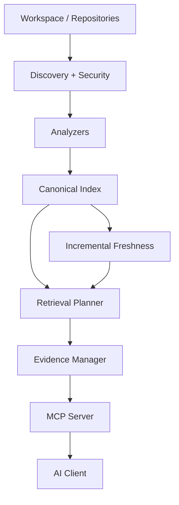
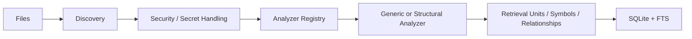
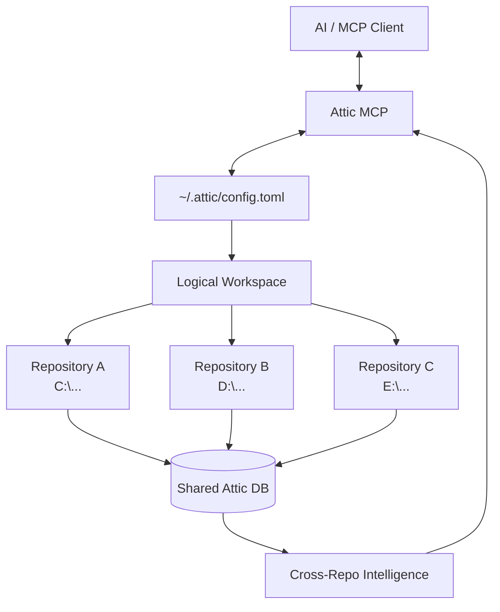

# Attic — Architecture

This document describes Attic **as it exists in the current codebase**, not
as a history of how it was built. "Key design decisions" and "Core
behavioral invariants" below consolidate what used to be a separate ADR/
contract document set; this file is now the single authoritative
architecture reference — nothing else needs to be read to understand how
the system behaves.

## What Attic is

Attic is a local-first code-intelligence server. It indexes source
repositories into a single SQLite database and serves retrieval — full-text
search, bounded file reads, repository maps, health status, and
evidence-grounded question answering — over the Model Context Protocol
(MCP), so an MCP-capable AI client can ground its answers in real,
verifiable source rather than guessing.

The guiding separation, preserved throughout the pipeline — see
[Retrieval & evidence](#retrieval--evidence) below:
`SOURCE != INDEX != RETRIEVAL CANDIDATE != EVIDENCE != CONTEXT != ANSWER`.

## Architecture overview



- **Discovery + security** (`attic-discovery`) — gitignore-aware walk,
  path-traversal/symlink guards, secrets scan. Any nested Git repository —
  submodule or plain independent checkout — becomes one `core_repositories`
  entry each (ADR-006).
- **Analyzers** (`attic-analyzers`) — `GenericAnalyzer` (universal
  fallback, every text file searchable) plus structural (tree-sitter)
  analyzers for Java, Python, Go, JavaScript, TypeScript.
- **Canonical index** (`attic-storage`, SQLite + FTS5) — files, retrieval
  units, structural nodes, symbols, relationships. One coordinated
  `WriterQueue` (single writer, serialized transactions); a `DbPool` of
  concurrent read-only connections (WAL mode). `attic-indexing` publishes
  each run atomically; no other code path writes index data.
- **Incremental freshness** (`attic-incremental`) — native filesystem
  watcher, falling back to periodic reconciliation. Freshness states:
  `CURRENT` / `STALE` / `UNKNOWN` / pending refresh. Flow on change:
  `filesystem change → verify → invalidate affected artifacts → recompute
  affected artifacts → publish → CURRENT` — Attic never rebuilds the whole
  workspace for a normal edit. Startup recovery reconciles any interrupted
  work before serving.
- **Retrieval Planner** (`attic-retrieval`) — a Query Evidence Contract
  selects required evidence per query intent (definition/navigation/
  configuration/architecture/debugging/impact/dependency/test/knowledge);
  candidates come from lexical (FTS5) + symbol + structural + relationship
  graph + optional semantic sources.
- **Evidence Manager** (`attic-evidence`) — verifies claims against
  retrieved evidence, assigns confidence, returns `INSUFFICIENT_EVIDENCE`
  explicitly rather than guessing.
- **Cross-repository intelligence** (`attic-crossrepo`) — resolves
  dependency edges across the workspace's member repositories once at startup; gates
  cross-repo-dependent answers while degraded.
- **MCP surface** (`attic-server`) — rmcp stdio transport; tools: `file`,
  `search`, `repo_map`, `status`, `context`.

### Indexing pipeline



Each file's `SourceRevision` (content-addressed identity via BLAKE3) and
the workspace's `WorkspaceSnapshot` are computed during discovery, before
the analyzer stage — every downstream artifact traces back to the exact
revision it was derived from.

### Retrieval & evidence


The guiding separation, preserved throughout:

```text
SOURCE  !=  INDEX  !=  RETRIEVAL CANDIDATE  !=  EVIDENCE  !=  CONTEXT  !=  ANSWER
```

Repositories on disk are always the source of truth. Every index, graph,
embedding, and cache is derived and disposable — Attic can always
reconstruct them from source (see `docs/PLAYBOOK.md` for reset/rebuild).

## Process and ownership model

- **One `attic` process owns one logical workspace.** (The binary is built
  from the `attic-server` crate — hence that crate/component name
  elsewhere in this doc — but the executable itself is named `attic`; see
  README Quick Start.) A single process holds the one SQLite writer
  (`WriterQueue`), one MCP stdio transport, and one filesystem watcher
  **per configured repository**, all for a given database file. This is
  not a configuration choice — `run_startup_recovery`, the watcher epoch,
  and `ops_server_state` all assume single-process ownership. Attic does
  **not** support multiple processes concurrently writing to the same
  database.
- **Multi-root workspaces**: the logical workspace is the SET of
  configured repository roots, not one filesystem directory — roots may
  live anywhere on disk with no common parent, no symlinks, and no Git
  submodule relationship between them. `ATTIC_CONFIG` points at a small
  config file listing arbitrary `[[repositories]]` roots (`ATTIC_WORKSPACE_ROOT`
  remains the single-repository convenience form; the two are mutually
  exclusive). Each root is validated and bootstrapped independently and
  becomes its own `core_repositories` row. Cross-repository dependency
  resolution (`attic-crossrepo::maintenance::sync_workspace`) runs once at
  startup, inside that single process, over every repository currently in
  storage:

  ```text
  Logical Workspace
  ├── repo A (C:\Users\<username>\Desktop\Dump)      ─┐
  ├── repo B (C:\Users\<username>\Path1)             ─┼─ each keeps independent
  └── repo C (C:\Users\<username>\Path3)    ─┘  source/index state (own
                 core_repositories row, own SourceRevisions, own watcher) —
                 sync_workspace resolves edges BETWEEN them and records
                 provenance back to the WorkspaceSnapshot (parent hash)
                 that was current when each edge was last resolved.
  ```

  The scheduler's task queue is shared across every configured
  repository: each claimed task resolves its OWN repository's root from
  storage before doing any filesystem work, so a task belonging to repo B
  is never executed against repo A's root, and one bad root never blocks
  or corrupts the others (failure isolation).

- **Repository isolation / stable identity**: every repository, file, and
  retrieval unit has a stable, content-addressed identity independent of
  path, so renames and moves don't fragment history and cross-repository
  references resolve deterministically.

## Storage concurrency

SQLite runs in WAL mode: one dedicated writer connection processes all
mutations serially through `WriterQueue` (a bounded work queue drained by a
single worker thread, inside the writer's own transaction per publication);
any number of reader connections (`DbPool`) run concurrently against the
same file without blocking the writer or each other. There is no second
writer path anywhere in the codebase — `attic-indexing`, `attic-incremental`,
and `attic-crossrepo` all route mutations through the same `WriterQueueHandle`.

## Language support

Rich structural analysis (symbols, definitions, relationships) is currently
implemented for **Java, Python, Go, JavaScript, and TypeScript** via
tree-sitter grammars. Every other text-based language or format — Rust,
Swift, C++, Kotlin, config files, docs, build files, anything not on that
list — is **not** unsupported: it falls back to `GenericAnalyzer`, which
still makes it fully searchable via `search` and readable via `file`, just
without symbol-level structure. Rich language support is additive, not a
gate on usability.

| Input | Analyzer | Result |
|---|---|---|
| Any text file | `GenericAnalyzer` | Full-text search, no symbols |
| Java / Python / Go / JS / TS | Structural (tree-sitter) | Symbols, definitions, relationships |
| Rust / Swift / C++ / Kotlin / etc. | `GenericAnalyzer` (today) | Full-text search; a dedicated structural analyzer can be added later without changing the pipeline |

## Project Knowledge authority model

```text
Source code ----------\
Tests -----------------\
Documentation ---------- Evidence Manager -> confidence-ranked evidence
Project Knowledge ------/    (authority differs; none is excluded)
Relationships ---------/
```

Project Knowledge is useful context, not permission to override
contradictory current source — a `context` query surfaces a detected
contradiction between a knowledge claim and the source/tests, it never
silently prefers one (see "Evidence & retrieval" invariants below).

Attic distinguishes two documentation tiers, enforced purely by path, in
`crates/attic-retrieval/src/candidates.rs::source_type_for_path` (regression
tests: `candidates::source_type_for_path_tests`):

- **`knowledge/**`** — deliberately curated content → `EvidenceSourceType::
  Knowledge` → `AuthorityLevel::ProjectKnowledge`, the highest documentation
  authority Attic assigns.
- **Everything else** (`README.md`, any `docs/**`, an `ARCHITECTURE.md`
  living outside `knowledge/`, etc.) → `EvidenceSourceType::Documentation` →
  `AuthorityLevel::Doc`, a medium authority. Still fully indexed, searchable,
  and usable as evidence — just not equal to curated project knowledge.

This is an **authority** distinction, not an indexing exclusion: ordinary
documentation is never excluded from search or `context` results, it simply
doesn't carry the same weight when the evidence manager resolves
contradictions. The boundary is the `knowledge/` path prefix only —
filenames are never special-cased outside it. See `knowledge/README.md` in
this repository for the end-user-facing explanation and template.

## Known design limitations (not blocking, no action taken)

These are honest, currently-accurate statements about gaps between the
schema/contracts and the current implementation — not defects introduced by
this pass, and not silently resolved by it. Each needs a product decision
before being closed:

- **`core_knowledge_items` is schema-only.** The table exists (referenced by
  cascading invalidation in `attic-storage::invalidation_ops`) but nothing
  currently writes to it — knowledge evidence is derived directly from path
  classification (`knowledge/**`) against the standard FTS/file-occurrence
  data, not from this dedicated table. Populating it would enable richer
  semantics (explicit supersession chains, `applicable_versions`) but has no
  current consumer.
- **Rename detection is heuristic only.** `core_identity_links` supports a
  `GIT_RENAME`/`EXACT` basis in its schema, but no code path currently
  computes it — all renames/moves are recorded via `CONTENT_MATCH`
  (content-hash equality), a `HEURISTIC` confidence level. Evidence claims
  about "the same file across a rename" are therefore never `EXACT` today.
- **Java import resolution is source-layout-only.** Resolution uses
  `src/main/java/...`-style path candidates plus in-run symbol evidence, not
  `pom.xml`/`build.gradle` dependency-scope parsing. The relationship schema
  already carries `dependency_basis=MAVEN|GRADLE` for when this is added.
- **No automatic re-index on analyzer-version bump.** Each index generation
  records the running `ANALYZER_REGISTRY_VERSION`, but nothing diffs a
  stored generation's recorded version against the current one to schedule
  invalidation automatically — an analyzer upgrade requires a manual
  re-index (see `docs/PLAYBOOK.md` Maintenance). Republication does replace
  analyzer-derived artifacts wholesale once triggered.
- **A corrupt database is not auto-quarantined.** On a startup integrity-check
  failure, Attic logs the violation and refuses to serve (fail-closed) but
  does **not** rename or move the corrupt `attic.db` aside automatically —
  the operator must do this manually before restoring from backup or
  rebuilding (see `docs/PLAYBOOK.md` Recovery).
- **No enforced upper bound on `max_context_tokens`.** `ResourceConfig::
  validate()` only rejects `0`; there is no configured ceiling on how high
  `ATTIC_MAX_CONTEXT_TOKENS` (default `8192`) can be set.

## Key design decisions

Permanent, non-obvious decisions worth knowing when changing this system —
condensed from the project's ADR history (full alternatives-considered
rationale lives only in the archive branch's git history now):

- **SQLite WAL checkpointing**: automatic frame-count checkpointing
  (`PRAGMA wal_autocheckpoint = 1000`, PASSIVE) on the writer connection,
  plus a background PASSIVE checkpoint every 5 minutes and a FULL checkpoint
  immediately before every backup — chosen over a purely time-based trigger
  to bound WAL growth under bursty write load without blocking readers.
- **Secret-pattern versioning**: `core_file_occurrences.secret_pattern_version`
  and `core_index_generations.secret_detector_version` are tracked
  independently of the schema version so that shipping an improved secret
  pattern set can trigger a targeted re-scan (`PARTIALLY_REBUILDABLE`)
  without forcing a full workspace rebuild.
- **Single-process ownership is a schema-level guarantee, not just a
  convention**: `ops_server_state` has a `CHECK` constraint pinning it to
  exactly one row, so a second process attempting to run against the same
  database cannot silently diverge into two independent server-state views.
- **Per-subsystem compatibility versioning**: `core_index_generations.
  subsystem_versions_json` tracks schema/analyzer/segmentation/discovery
  versions independently, so a change in one subsystem (e.g. an analyzer
  upgrade) triggers exactly the scoped invalidation it needs
  (`PARTIALLY_REBUILDABLE`) instead of an all-or-nothing rebuild.
- **Discovery uses the `ignore` crate** (ripgrep's gitignore engine) rather
  than a hand-rolled `.gitignore` parser, and **BLAKE3** for all content
  hashing — both chosen to avoid subtly-wrong reimplementations of
  well-specified algorithms.
- **Any nested Git repository is the multi-repository primitive, not
  specifically a Git submodule**: discovery (`attic-discovery::walk`)
  treats any subdirectory containing its own `.git` (file or directory) as
  a separate repository boundary — a true submodule (`.gitmodules`-linked)
  and a plain, independently-cloned repository sitting under the workspace
  root are handled identically. Each becomes its own `core_repositories`
  row with its own identity; `create_workspace_snapshot` records each
  repository's current `SourceRevisionId` generically, so the workspace
  snapshot changes whenever any member repository advances — this is not
  gitlink/`.gitmodules`-specific. Uninitialized submodules (present in
  `.gitmodules` but not checked out) are skipped, not errored.
- **`CancellationToken` is a plain `Arc<AtomicBool>` newtype**, not
  `tokio_util::sync::CancellationToken` — analyzer/indexing work is
  synchronous, so a lock-free shared flag is sufficient and avoids an
  unnecessary tokio-internals dependency at that layer. (rmcp's own
  cancellation token is used separately at the MCP-service-lifecycle level.)
- **Analyzer selection is deterministic**: `AnalyzerRegistry::select()`
  picks the analyzer with the highest-ordinal `CapabilityKind` for a file
  type, breaking ties by name — reproducible indexing runs are a hard
  requirement, so "first registered wins" was rejected.
- **`GenericAnalyzer` chunks at 500 lines per `RetrievalUnit`** — large
  enough for useful context, small enough to stay well under embedding
  token limits if the semantic layer is enabled; language-agnostic since it
  requires no parser.
- **Filesystem watching uses `notify-debouncer-full`** (on top of `notify`
  8.2.x) for cross-platform debounced change events, with periodic
  reconciliation as the documented fallback when native watching isn't
  available.
- **Cross-file relationship edges persist even when unresolved.** An import
  or reference that can't yet be resolved to a concrete symbol is stored
  with a deterministic *logical* id rather than being dropped, so it becomes
  traceable evidence immediately and resolves in place once its target is
  indexed.
- **Source verification is span-local with strict lineage preservation**:
  when `context` verifies a claim against source, it re-checks the exact
  cited span against the exact `source_revision_id` it was drawn from —
  never a broader "does this file still look right" check — and charges the
  actual bytes scanned against the query's resource budget, not an estimate.
- **Claims only ever cite context-grounded evidence.** The evidence
  pipeline does not allow a claim in a `context` response to reference
  evidence that isn't part of the assembled context returned alongside it.

## Core behavioral invariants

A condensed reference of the invariants that most affect correctness and
observable behavior, verified against the current implementation. This is
not exhaustive engineering detail (that level of specification now exists
only in git history on the archive branch) — it's what a maintainer changing
this system needs to not accidentally break.

**Discovery & security**
- A path marked security-forbidden is never made eligible by any include
  rule, regardless of rule ordering.
- Ignored paths produce no occurrence record at all — not even as excluded.
- The discovery walk never escapes the configured workspace root, including
  via symlinks.
- Discovery never executes repository content as code or shell commands.

**Identity**
- A file's stable identity is never reused after deletion (recreating a file
  at the same path gets a new identity) except a narrow, conservative
  same-content-same-path-same-window reuse case.
- Identity-match confidence is always explicit; a `HEURISTIC` match is never
  silently promoted to `EXACT` (see the rename-detection limitation above).
- Deleting a file invalidates its dependent derived artifacts (symbols,
  relationships, retrieval units) without deleting the file's identity
  record itself.

**Secrets**
- Secret bytes never reach `core_retrieval_units`, FTS tables, evidence, or
  any other derived/persisted layer — scanning happens before content enters
  the pipeline, and the unredacted in-memory copy is discarded after
  analysis.
- A path-level security-forbidden exclusion always takes precedence over
  scanner results — the file is never even opened for scanning.

**Storage**
- Every row with a foreign key to a source revision has a non-null,
  valid `source_revision_id` — an artifact that loses this link is treated
  as invalid rather than trusted.
- No user-controlled string is ever concatenated into SQL; all queries use
  parameter binding.
- `core_evidence` rows are append-only — a stale row is marked `STALE`, not
  overwritten.

**Freshness & invalidation**
- An artifact in `INVALID` state is never returned as valid evidence; a
  `STALE` one may be returned, but only with that state visibly attached.
- The invalidation dependency graph is acyclic, and propagation always
  completes before any dependent recomputation begins.
- Invalidated rows are never silently deleted — they persist until an
  explicit maintenance pass prunes them.

**Evidence & retrieval**
- Evidence with `freshness_state = INVALID` never reaches an LLM-facing
  context.
- A detected contradiction between evidence sources is surfaced, never
  silently dropped in favor of one side.
- `FAST` mode never touches the filesystem or an embedding lookup — a code
  path that does so for a `FAST`-mode query is a contract violation.
- A `RetrievalPlan` is finalized exactly once and its steps are append-only;
  every piece of evidence considered is accounted for as either used or
  explicitly dropped, never silently ignored.

**Recovery**
- The server refuses to accept any MCP tool call until startup recovery
  reaches a ready state (fail-closed, not a soft warning).
- Startup recovery is idempotent — running it against an already-recovered
  database is a no-op.
- No recovery step deletes source files; only derived artifacts (indexes,
  plans, caches) are ever invalidated or rebuilt.
- A crash-recovery backup is written only after a successful WAL checkpoint,
  never mid-recovery.

**Resources**
- Every scheduled unit of work has an associated resource budget from
  creation; nothing runs unbudgeted.
- The writer queue is drained (bounded) before process exit — shutdown never
  abandons a write mid-flight without at least attempting to finish it.

## Semantic layer (optional, default-disabled)

Semantic (embedding-based) retrieval is **disabled by default** and only
activates when `ATTIC_SEMANTIC=1` is set. The currently shipped embedder
(`HashingEmbedder`) is a deterministic hashing baseline — an experimental
placeholder, not a validated neural embedding model. When disabled or
degraded, canonical (lexical/structural) retrieval is entirely unaffected;
the semantic layer never gates or blocks an answer (ADR-014, decision D1).
See ADR-013/ADR-014 for the full rationale.

## Resource management

A `ResourceMonitor` (`attic-storage::resource_manager`) tracks real process
RSS and enforces configurable budgets: total memory, foreground MCP query
concurrency, and background worker concurrency. Foreground (interactive MCP
calls) is never starved by background work (indexing, semantic enrichment) —
background capacity is capped strictly below foreground capacity, and under
memory pressure (`Pause`/`Emergency` advisories) expensive `DEEP` retrieval
mode is automatically downgraded to `NORMAL` rather than failing outright.

## Security

- Path traversal and symlink escapes are rejected before any file is read
  (`canonicalize_within_root`).
- A secrets-scanning layer redacts or excludes matched content before it can
  reach an MCP response, regardless of which tool requests it.
- `.git` internals are blocked at the server layer unconditionally.
- All MCP tool arguments are validated (length, character class, numeric
  bounds) before use; no raw string is interpolated into SQL — dynamic SQL
  uses compile-time-literal identifiers only.

## Crash recovery

On every startup, before serving any MCP request, Attic runs
`run_startup_recovery`: it resets orphaned tasks, reconciles any indexing run
that was interrupted mid-publication, and records the watcher epoch. This is
fail-closed — if recovery cannot establish a safe state, or the subsequent
database integrity check fails, the process refuses to serve rather than
present possibly-stale or corrupt data as `CURRENT`. On clean shutdown,
Attic performs an explicit WAL checkpoint and writes a crash-recovery backup
(most recent 3 retained) before exiting — see "Core behavioral invariants"
above for the recovery guarantees this implements.

## Logical workspace model (multi-root, MCP-configured)

ONE Attic MCP process serves ONE persistent logical workspace made of
ZERO/ONE/MANY arbitrary repository roots. The workspace is configured
through MCP itself (the `workspace` tool: `inspect`/`add`/`remove`/`set`),
persisted atomically to `<ATTIC_HOME>/config.toml`, and reloaded on every
subsequent launch. Historical repositories left in storage after membership
changes never leak into active retrieval, status, WorkspaceSnapshot, or
cross-repo intelligence.



Configuration precedence: `ATTIC_CONFIG` → `<ATTIC_HOME>/config.toml` →
`ATTIC_WORKSPACE_ROOT` → UNCONFIGURED. `ATTIC_HOME` (default `~/.attic`)
pins the entire application home: config + database + backups + scratch.

## MCP surface

Attic speaks MCP exclusively over stdio: **stdout carries only the MCP
JSON-RPC protocol; every log line goes to stderr** (`tracing`, controlled by
`ATTIC_LOG`/`RUST_LOG`). This has been verified by a smoke test that spawns
the release binary and inspects both streams directly. The six registered
tools (`file`, `search`, `repo_map`, `status`, `context`, `workspace`) are
documented in the README; their exact schemas are defined once in
`crates/attic-server/src/main.rs::make_tools()` and returned verbatim via
`tools/list` — that function is the single source of truth for the tool
surface.
