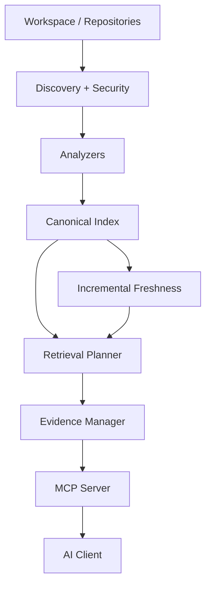
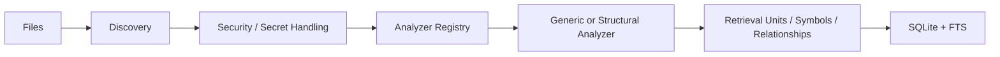
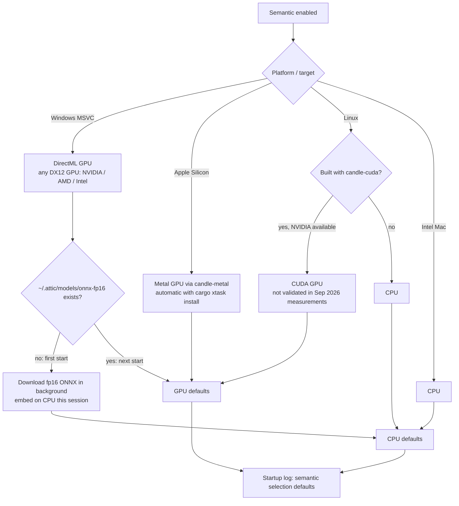
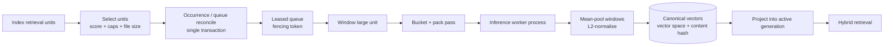
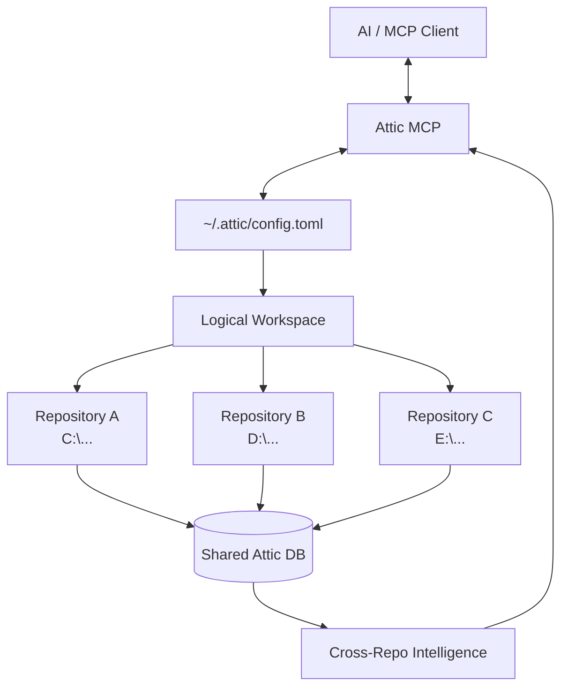

# 🏛️ Attic — Architecture

This document describes Attic **as it exists in the current codebase**, not
as a history of how it was built. "Key design decisions" and "Core
behavioral invariants" below consolidate what used to be a separate ADR/
contract document set; this file is now the single authoritative
architecture reference — nothing else needs to be read to understand how
the system behaves.

## Contents

- [What Attic is](#what-attic-is)
- [Architecture overview](#architecture-overview)
- [Process and ownership model](#process-and-ownership-model)
- [Storage concurrency](#storage-concurrency)
- [Language support](#language-support)
- [Project Knowledge authority model](#project-knowledge-authority-model)
- [Known design limitations](#known-design-limitations)
- [Key design decisions](#key-design-decisions)
- [Core behavioral invariants](#core-behavioral-invariants)
- [Semantic layer](#semantic-layer-optional-default-enabled)
- [Resource management](#resource-management)
- [Security](#security)
- [Crash recovery](#crash-recovery)
- [Logical workspace model](#logical-workspace-model-multi-root-mcp-configured)
- [MCP surface](#mcp-surface)

## What Attic is

Attic is a local-first code-intelligence server. It indexes source
repositories into a single SQLite database and serves retrieval — full-text
search, bounded file reads, repository maps, health status, and
evidence-grounded question answering — over the Model Context Protocol
(MCP), so an MCP-capable AI client can ground its answers in real,
verifiable source rather than guessing.

The guiding separation, preserved throughout the pipeline — see
[Retrieval & evidence](#retrieval--evidence) below:
`SOURCE != INDEX != RETRIEVAL CANDIDATE != EVIDENCE != CONTEXT != ANSWER`.

## Architecture overview


```mermaid
flowchart TD
    A[Workspace / Repositories] --> B[Discovery + Security]
    B --> C[Analyzers]
    C --> D[Canonical Index]
    D --> E[Incremental Freshness]
    D --> F[Retrieval Planner]
    E --> F
    F --> G[Evidence Manager]
    G --> H[MCP Server]
    H --> I[AI Client]
```

- **Discovery + security** (`attic-discovery`) — gitignore-aware walk,
  path-traversal/symlink guards, secrets scan. Hidden entries (dot-prefixed,
  plus the hidden attribute on Windows) are skipped, except content-bearing
  dot-files listed in `INDEXED_HIDDEN_FILE_NAMES` (AEM/FileVault
  `.content.xml`). Any nested Git repository —
  submodule or plain independent checkout — becomes one `core_repositories`
  entry each (ADR-006).
- **Analyzers** (`attic-analyzers`) — `GenericAnalyzer` (universal
  fallback, every text file searchable) plus pluggable language and
  platform analyzers composed from a `PluginCatalog`: full hand-written
  tree-sitter analyzers (Java, Python, Go, JavaScript, TypeScript), a
  generic `tags.scm`-driven engine (symbols + intra-file references only)
  covering eleven more languages, a JSON analyzer, and the AEM platform plugin
  — see [Language support](#language-support) below.
- **Canonical index** (`attic-storage`, SQLite + FTS5) — files, retrieval
  units, structural nodes, symbols, relationships. One coordinated
  `WriterQueue` (single writer, serialized transactions); a `DbPool` of
  concurrent read-only connections (WAL mode). `attic-indexing` publishes
  each run atomically; no other code path writes index data.
- **Incremental freshness** (`attic-incremental`) — native filesystem
  watcher, falling back to periodic reconciliation. Freshness states:
  `CURRENT` / `STALE` / `UNKNOWN` / pending refresh. Flow on change:
  `filesystem change → verify → invalidate affected artifacts → recompute
  affected artifacts → publish → CURRENT` — Attic never rebuilds the whole
  workspace for a normal edit. Startup recovery reconciles any interrupted
  work before serving.
- **Retrieval Planner** (`attic-retrieval`) — a Query Evidence Contract
  selects required evidence per query intent (definition/navigation/
  configuration/architecture/debugging/impact/dependency/test/knowledge);
  candidates come from lexical (FTS5) + symbol + structural + relationship
  graph + optional semantic sources.
- **Evidence Manager** (`attic-evidence`) — verifies claims against
  retrieved evidence, assigns confidence, returns `INSUFFICIENT_EVIDENCE`
  explicitly rather than guessing.
- **Cross-repository intelligence** (`attic-crossrepo`) — resolves
  dependency edges across the workspace's member repositories once at startup; gates
  cross-repo-dependent answers while degraded.
- **MCP surface** (`attic-server`) — rmcp stdio transport (relayed over a
  daemon's local socket/named pipe on later launches); tools: `file`,
  `search`, `repo_map`, `status`, `context`, `workspace`, `logging`, and the
  admin tool `debug_drain_task`.

### Indexing pipeline


```mermaid
flowchart LR
    A[Files] --> B[Discovery]
    B --> C[Security / Secret Handling]
    C --> D[Analyzer Registry]
    D --> E[Generic or Structural Analyzer]
    E --> F[Retrieval Units / Symbols / Relationships]
    F --> G[SQLite + FTS]
```

Each file's `SourceRevision` (content-addressed identity via BLAKE3) and
the workspace's `WorkspaceSnapshot` are computed during discovery, before
the analyzer stage — every downstream artifact traces back to the exact
revision it was derived from.

**Throughput design.** Per-file analysis is pure (no database access), so
both full and incremental indexing run it on a bounded worker pool
(`[indexing] analysis_threads`, default logical CPUs minus two). Workers
pull files from one shared cursor over a largest-first order, so a few
multi-megabyte files never leave the other workers idle; results are
reassembled in discovery order, so output never depends on thread count.
The analyzer registry is built once per configuration and shared. The
single atomic publication reuses prepared statements for every per-row
insert/delete (retrieval units, FTS rows, structural nodes, symbols,
relationships), and structural nodes of a replaced file are deleted with
one statement per file (the self-referential `parent_id` foreign key is
`NO ACTION`, checked at statement end).

### Retrieval & evidence


```mermaid
flowchart LR
    Q[Question] --> P[Retrieval Planner]
    P --> C[Candidates]
    C --> E[Evidence Validation]
    E --> M[Evidence Manager]
    M --> X[Context]
    X --> A[AI Client]
```

The guiding separation, preserved throughout:

```text
SOURCE  !=  INDEX  !=  RETRIEVAL CANDIDATE  !=  EVIDENCE  !=  CONTEXT  !=  ANSWER
```

Repositories on disk are always the source of truth. Every index, graph,
embedding, and cache is derived and disposable — Attic can always
reconstruct them from source (see `docs/PLAYBOOK.md` for reset/rebuild).

## Process and ownership model

- **One `attic` daemon owns one logical workspace — per database, not per
  process launch.** (The binary is built from the `attic-server` crate —
  hence that crate/component name elsewhere in this doc — but the
  executable itself is named `attic`; see README Quick Start.) The first
  `attic` launch for a given database wins an advisory `attic.lock` and
  becomes that database's daemon: it alone holds the one SQLite writer
  (`WriterQueue`), one filesystem watcher **per configured repository**,
  and runs startup recovery, for as long as it stays up. This single-owner
  invariant is not a configuration choice — `run_startup_recovery`, the
  watcher epoch, and `ops_server_state` all assume it — it is simply no
  longer tied to "one process launch"; it is now tied to "one daemon per
  database". Every later `attic` launch against the same database fails
  that same `try_lock()` and instead becomes a thin relay: it discovers the
  daemon's local-socket address (`interprocess::local_socket`, published to
  a sibling `attic.ipc` file only after the daemon's listener is bound) and
  splices its own MCP stdio transport to that socket byte-for-byte, so
  multiple windows on the same project run genuinely concurrently against
  the one shared live state — there is no second writer, watcher, or
  recovery pass to reconcile. The daemon shuts down on an idle timeout once
  every connection (its own original caller's included) has disconnected,
  or on SIGINT; a crashed daemon's `attic.lock` is released automatically
  by the OS, so the next launch re-elects cleanly. See
  `crates/attic-server/src/daemon.rs` for the election/relay/accept-loop
  implementation. There is exactly one serving path: only one process is
  ever the daemon for a given database. If the daemon wins the lock but
  cannot create its local socket, it still serves its own client and exits
  as soon as that client disconnects (nobody else could connect). A relay
  whose daemon dies re-runs the election and, if it wins, promotes itself
  to daemon while keeping its own client's session alive. The idle timeout
  defaults to 90 s (`ATTIC_DAEMON_IDLE_TIMEOUT_MS`).

  ```mermaid
  stateDiagram-v2
      [*] --> Election: launch
      Election --> Daemon: won attic.lock
      Election --> Relay: lock held, attic.ipc found
      Relay --> Election: daemon disconnected
      Daemon --> [*]: idle timeout / Ctrl+C
      Relay --> [*]: client disconnected
  ```
- **Multi-root workspaces**: the logical workspace is the SET of
  configured repository roots, not one filesystem directory — roots may
  live anywhere on disk with no common parent, no symlinks, and no Git
  submodule relationship between them. `ATTIC_CONFIG` points at a small
  config file listing arbitrary `[[repositories]]` roots (`ATTIC_WORKSPACE_ROOT`
  remains the single-repository convenience form; the two are mutually
  exclusive). Each root is validated and bootstrapped independently and
  becomes its own `core_repositories` row. Cross-repository dependency
  resolution (`attic-crossrepo::maintenance::sync_workspace`) runs once at
  startup, inside the daemon, over the configured member repositories
  (repositories left in storage by an earlier configuration never
  contribute edges):

  ```text
  Logical Workspace
  ├── repo A (C:\Users\<username>\projects\repo-a)      ─┐
  ├── repo B (C:\Users\<username>\projects\repo-b)       ─┼─ each keeps independent
  └── repo C (C:\Users\<username>\projects\repo-c)  ─┘  source/index state (own
                 core_repositories row, own SourceRevisions, own watcher) —
                 sync_workspace resolves edges BETWEEN them and records
                 provenance back to the WorkspaceSnapshot (parent hash)
                 that was current when each edge was last resolved.
  ```

  The scheduler's task queue is shared across every configured
  repository: every task carries its repository, and each claimed task
  resolves that repository's root from storage before doing any filesystem
  work — a task whose repository is no longer registered fails instead of
  running anywhere else — so one bad root never blocks or corrupts the
  others (failure isolation). Bootstrap, the watcher filter, background
  reconciliation and recomputation all use one discovery policy, so
  `attic.toml [indexing] exclude` applies identically everywhere.

- **Repository isolation / stable identity**: every repository, file, and
  retrieval unit has a stable, content-addressed identity independent of
  path, so renames and moves don't fragment history and cross-repository
  references resolve deterministically.

## Storage concurrency

SQLite runs in WAL mode: one dedicated writer connection processes all
mutations serially through `WriterQueue` (a bounded work queue drained by a
single worker thread, inside the writer's own transaction per publication);
any number of reader connections (`DbPool`) run concurrently against the
same file without blocking the writer or each other. There is no second
writer path anywhere in the codebase — `attic-indexing`, `attic-incremental`,
and `attic-crossrepo` all route mutations through the same `WriterQueueHandle`.

### Database lifecycle and retention

Deleted-file tombstones, invalidation-audit records, and terminal
(completed/failed/cancelled) task rows are not kept forever:
`prune_old_tombstones`, `prune_old_invalidation_records`, and
`prune_terminal_tasks` (default retention 90/90/30 days respectively) run as
part of `run_maintenance`, which also issues `VACUUM` against both
`attic.db` and `semantic.db`. `run_maintenance` is wired into the shutdown
sequence for both databases and runs on every clean shutdown — process
exit, SIGINT, and a daemon's idle-timeout exit alike — so on-disk file size
is expected to shrink after deletes rather than growing unbounded across
the lifetime of a long-running daemon.

## Language support

Structural analysis is now a **three-tier model**. Tier 1 — full symbols,
definitions, imports, and relationships — is hand-written per language via
tree-sitter grammars, for **Java, Python, Go, JavaScript, and TypeScript**
(`crates/attic-analyzers/src/structural/`; `.tsx` files specifically use the
JSX-aware `LANGUAGE_TSX` grammar rather than the JSX-blind
`LANGUAGE_TYPESCRIPT` one, a previously-existing bug fixed alongside this
tier). Tier 2 — symbol definitions and intra-file references only, no
import or relationship resolution — is a single generic engine
(`crates/attic-analyzers/src/structural/tags_generic.rs`) driven by
tree-sitter's `tags.scm` convention (the same mechanism GitHub/Neovim/Helix
use for cross-language "go to definition"), covering **C, C++, Ruby, C#,
Scala, PHP, Swift, Lua, Rust, Kotlin, and Dockerfile** without any hand-written
per-language AST-walking code; the capability gap versus tier 1 is
declared explicitly in code (`ImportExtraction=None`,
`RelationshipResolution=None`), not silently overclaimed. Every other
text-based language or format not on either list — config files, docs,
build files, etc. — falls back to tier 3, `GenericAnalyzer`, which
still makes it fully searchable via `search` and readable via `file`, just
without symbol-level structure. Rich language support is additive, not a
gate on usability.

### Analyzer plugins

Every language or platform is an `AnalyzerPlugin`
(`crates/attic-analyzers/src/plugin.rs`): a stable config-facing id, a
`language_hint(path)` that claims repository-relative paths, and a
`register` that adds its analyzers to an `AnalyzerRegistry`. The
`PluginCatalog` orders plugins (path-specific platform plugins such as AEM
first, so they win over extension rules) and builds a registry from an
`AnalyzerSelection` — `attic.toml [indexing] analyzers` /
`disabled_analyzers`, where empty means every plugin and unknown ids fail
startup. `attic-indexing`'s `infer_language_hint` delegates to the catalog,
so hint tags and registered tags come from one place and cannot drift. A
hint is tried against the language-tag map before the `FileType`-keyed map,
so tier-1 languages are never shadowed by a tier-2 entry, and a disabled
plugin's tag is simply unregistered: its files fall through to
`GenericAnalyzer` and stay fully searchable. Paths are matched with `/`
separators and ASCII case-insensitively on every platform. Third-party
plugins join a catalog through `PluginCatalog::with_plugin` (duplicate ids
are rejected). The analysis cache is keyed on the effective plugin set, so a
retry after a configuration change never replays output from different
analyzers.

### AEM platform plugin

`crates/attic-analyzers/src/aem.rs` classifies FileVault content by path —
`.content.xml` and `*.xml` under `jcr_root/` (JCR content), `*.html` under
`jcr_root/` and `*.htl` (HTL), `*.cfg.json` and Felix `*.config` in
`config*`/`osgiconfig` folders (OSGi configuration), and `js.txt`/`css.txt`
under `jcr_root/` (clientlib manifests). Plain HTML/XML/JSON elsewhere is
never claimed. It extracts path-qualified JCR nodes (FileVault names such as
`_cq_dialog` decode to `cq:dialog`) with `jcr:primaryType`,
`sling:resourceType`/`resourceSuperType`, `cq:template` and clientlib
metadata; HTL `data-sly-template` definitions and `data-sly-use` bindings;
OSGi PIDs, factory names, run modes and properties; and clientlib sources.
Resource types, super types, templates, HTL use/include/resource targets and
clientlib embeds/dependencies are recorded as imports. Retrieval units come
from `GenericAnalyzer`, so lexical coverage is unchanged. Parsing is
tolerant (malformed input yields partial structure plus a warning, never a
dispatch error) and bounded by the entity cap, time budget and
cancellation. Capabilities are declared honestly: symbols and imports only,
no cross-file resolution.

| Input | Analyzer | Result |
|---|---|---|
| Any text file | `GenericAnalyzer` | Full-text search, no symbols |
| Java / Python / Go / JS / TS (incl. `.tsx`) | Tier 1 — hand-written tree-sitter | Full symbols, definitions, imports, relationships |
| C / C++ / Ruby / C# / Scala / PHP / Swift / Lua / Rust / Kotlin / Dockerfile | Tier 2 — generic tags.scm | Symbol definitions + intra-file references only |
| JSON | `JsonAnalyzer` | Canonical subtree chunks with JSON-pointer addressing |
| AEM (JCR content, HTL, OSGi configs, clientlibs) | `aem` platform plugin | Path-qualified nodes/symbols and imports; lexical units from `GenericAnalyzer` |
| Everything else | Tier 3 — `GenericAnalyzer` | Full-text (and semantic) search; a dedicated analyzer can be added as a plugin without changing the pipeline (see `docs/PLAYBOOK.md`) |

## Project Knowledge authority model

```text
Source code ----------\
Tests -----------------\
Documentation ---------- Evidence Manager -> confidence-ranked evidence
Project Knowledge ------/    (authority differs; none is excluded)
Relationships ---------/
```

Project Knowledge is useful context, not permission to override
contradictory current source — a `context` query surfaces a detected
contradiction between a knowledge claim and the source/tests, it never
silently prefers one (see "Evidence & retrieval" invariants below).

Attic distinguishes two documentation tiers, enforced purely by path, in
`crates/attic-retrieval/src/candidates.rs::source_type_for_path` (regression
tests: `candidates::source_type_for_path_tests`):

- **`knowledge/**`** — deliberately curated content → `EvidenceSourceType::
  Knowledge` → `AuthorityLevel::ProjectKnowledge`, the highest documentation
  authority Attic assigns.
- **Everything else** (`README.md`, any `docs/**`, an `ARCHITECTURE.md`
  living outside `knowledge/`, etc.) → `EvidenceSourceType::Documentation` →
  `AuthorityLevel::Doc`, a medium authority. Still fully indexed, searchable,
  and usable as evidence — just not equal to curated project knowledge.

This is an **authority** distinction, not an indexing exclusion: ordinary
documentation is never excluded from search or `context` results, it simply
doesn't carry the same weight when the evidence manager resolves
contradictions. The boundary is the `knowledge/` path prefix only —
filenames are never special-cased outside it. See `knowledge/README.md` in
this repository for the end-user-facing explanation and template.

## Known design limitations

Honest statements about current gaps between the schema/contracts and the
implementation. Each needs a product decision before it is closed:

<details>
<summary><strong>Show the four known limitations</strong></summary>

- **Rename detection is heuristic only.** `core_identity_links` supports a
  `GIT_RENAME`/`EXACT` basis in its schema, but no code path currently
  computes it — all renames/moves are recorded via `CONTENT_MATCH`
  (content-hash equality), a `HEURISTIC` confidence level. Evidence claims
  about "the same file across a rename" are therefore never `EXACT` today.
- **Java import resolution is source-layout-only.** Resolution uses
  `src/main/java/...`-style path candidates plus in-run symbol evidence, not
  `pom.xml`/`build.gradle` dependency-scope parsing. The relationship schema
  already carries `dependency_basis=MAVEN|GRADLE` for when this is added.
- **Analyzer changes apply on restart, not live.** Every startup runs a
  full authoritative index pass per configured root, and the analysis cache
  is keyed on `ANALYZER_REGISTRY_VERSION` plus the effective plugin set, so
  an upgraded binary or a changed `[indexing] analyzers` selection
  re-analyzes affected files on the next start. A running daemon does not
  hot-reload analyzers.
- **A corrupt database is not auto-quarantined.** On a startup integrity-check
  failure, Attic logs the violation and refuses to serve (fail-closed) but
  does **not** rename or move the corrupt `attic.db` aside automatically —
  the operator must do this manually before restoring from backup or
  rebuilding (see `docs/PLAYBOOK.md` Recovery).

</details>

## Key design decisions

Permanent, non-obvious decisions worth knowing when changing this system —
condensed from the project's ADR history (full alternatives-considered
rationale lives only in the archive branch's git history now):

<details>
<summary><strong>Show all design decisions</strong></summary>

- **SQLite WAL checkpointing**: automatic frame-count checkpointing
  (`PRAGMA wal_autocheckpoint = 1000`, PASSIVE) on the writer connection,
  plus a `TRUNCATE` checkpoint during clean shutdown immediately before the
  crash-recovery backup — bounding WAL growth under bursty write load
  without ever blocking readers.
- **Secret-pattern versioning**: `core_file_occurrences.secret_pattern_version`
  and `core_index_generations.secret_detector_version` are tracked
  independently of the schema version so that shipping an improved secret
  pattern set can trigger a targeted re-scan (`PARTIALLY_REBUILDABLE`)
  without forcing a full workspace rebuild.
- **Single-writer ownership is a schema-level guarantee, not just a
  convention**: `ops_server_state` has a `CHECK` constraint pinning it to
  exactly one row, so a second process attempting to write against the same
  database outside the daemon/relay protocol cannot silently diverge into
  two independent server-state views (see [Process and ownership
  model](#process-and-ownership-model): one daemon owns the writer per
  database; later launches relay to it rather than opening a second one).
- **Per-subsystem compatibility versioning**: `core_index_generations.
  subsystem_versions_json` records the schema, analyzer-registry, indexer
  and secret-detector versions independently, so each generation states
  exactly which subsystem versions produced it.
- **Discovery uses the `ignore` crate** (ripgrep's gitignore engine) rather
  than a hand-rolled `.gitignore` parser, and **BLAKE3** for all content
  hashing — both chosen to avoid subtly-wrong reimplementations of
  well-specified algorithms.
- **Any nested Git repository is the multi-repository primitive, not
  specifically a Git submodule**: discovery (`attic-discovery::walk`)
  treats any subdirectory containing its own `.git` (file or directory) as
  a separate repository boundary — a true submodule (`.gitmodules`-linked)
  and a plain, independently-cloned repository sitting under the workspace
  root are handled identically. Each becomes its own `core_repositories`
  row with its own identity; `create_workspace_snapshot` records each
  repository's current `SourceRevisionId` generically, so the workspace
  snapshot changes whenever any member repository advances — this is not
  gitlink/`.gitmodules`-specific. Uninitialized submodules (present in
  `.gitmodules` but not checked out) are skipped, not errored.
- **`CancellationToken` is a plain `Arc<AtomicBool>` newtype**, not
  `tokio_util::sync::CancellationToken` — analyzer/indexing work is
  synchronous, so a lock-free shared flag is sufficient and avoids an
  unnecessary tokio-internals dependency at that layer. (rmcp's own
  cancellation token is used separately at the MCP-service-lifecycle level.)
- **Analyzer selection is deterministic**: `AnalyzerRegistry::select()`
  picks the analyzer with the highest-ordinal `CapabilityKind` for a file
  type, breaking ties by name — reproducible indexing runs are a hard
  requirement, so "first registered wins" was rejected.
- **`GenericAnalyzer` chunks at ~2,000 characters per `RetrievalUnit`**
  (`TARGET_CHUNK_CHARS`, recorded as `CHUNKING_VERSION`) — large enough for
  useful context, small enough to stay well under embedding token limits;
  chunks tile the file exactly and an over-long single line is split
  losslessly. Language-agnostic since it requires no parser.
- **Filesystem watching uses `notify-debouncer-full`** (on top of `notify`
  8.2.x) for cross-platform debounced change events, with periodic
  reconciliation as the documented fallback when native watching isn't
  available.
- **Cross-file relationship edges persist even when unresolved.** An import
  or reference that can't yet be resolved to a concrete symbol is stored
  with a deterministic *logical* id rather than being dropped, so it becomes
  traceable evidence immediately and resolves in place once its target is
  indexed.
- **Source verification is span-local with strict lineage preservation**:
  when `context` verifies a claim against source, it re-checks the exact
  cited span against the exact `source_revision_id` it was drawn from —
  never a broader "does this file still look right" check — and charges the
  actual bytes scanned against the query's resource budget, not an estimate.
- **Claims only ever cite context-grounded evidence.** The evidence
  pipeline does not allow a claim in a `context` response to reference
  evidence that isn't part of the assembled context returned alongside it.

</details>

## Core behavioral invariants

A condensed reference of the invariants that most affect correctness and
observable behavior, verified against the current implementation. This is
not exhaustive engineering detail (that level of specification now exists
only in git history on the archive branch) — it's what a maintainer changing
this system needs to not accidentally break.

<details>
<summary><strong>Show invariants by area</strong> (Discovery, Identity, Secrets, Storage, Freshness, Evidence, Recovery, Resources)</summary>

**Discovery & security**
- A path marked security-forbidden is never made eligible by any include
  rule, regardless of rule ordering.
- Ignored paths produce no occurrence record at all — not even as excluded.
- The discovery walk never escapes the configured workspace root, including
  via symlinks.
- Discovery never executes repository content as code or shell commands.

**Identity**
- A file's stable identity is never reused after deletion (recreating a file
  at the same path gets a new identity) except a narrow, conservative
  same-content-same-path-same-window reuse case.
- Identity-match confidence is always explicit; a `HEURISTIC` match is never
  silently promoted to `EXACT` (see the rename-detection limitation above).
- Deleting a file invalidates its dependent derived artifacts (symbols,
  relationships, retrieval units) without deleting the file's identity
  record itself.

**Secrets**
- Secret bytes never reach `core_retrieval_units`, FTS tables, evidence, or
  any other derived/persisted layer — scanning happens before content enters
  the pipeline, and the unredacted in-memory copy is discarded after
  analysis.
- A path-level security-forbidden exclusion always takes precedence over
  scanner results — the file is never even opened for scanning.

**Storage**
- Every row with a foreign key to a source revision has a non-null,
  valid `source_revision_id` — an artifact that loses this link is treated
  as invalid rather than trusted.
- No user-controlled string is ever concatenated into SQL; all queries use
  parameter binding.

**Freshness & invalidation**
- An artifact in `INVALID` state is never returned as valid evidence; a
  `STALE` one may be returned, but only with that state visibly attached.
- The invalidation dependency graph is acyclic, and propagation always
  completes before any dependent recomputation begins.
- Invalidated rows are never silently deleted — they persist until an
  explicit maintenance pass prunes them.

**Evidence & retrieval**
- Evidence with `freshness_state = INVALID` never reaches an LLM-facing
  context.
- A detected contradiction between evidence sources is surfaced, never
  silently dropped in favor of one side.
- `FAST` mode never touches the filesystem or an embedding lookup — a code
  path that does so for a `FAST`-mode query is a contract violation.
- A `RetrievalPlan` is finalized exactly once and its steps are append-only;
  every piece of evidence considered is accounted for as either used or
  explicitly dropped, never silently ignored.

**Recovery**
- The server refuses to accept any MCP tool call until startup recovery
  reaches a ready state (fail-closed, not a soft warning).
- Startup recovery is idempotent — running it against an already-recovered
  database is a no-op.
- No recovery step deletes source files; only derived artifacts (indexes,
  plans, caches) are ever invalidated or rebuilt.
- A crash-recovery backup is written only after a successful WAL checkpoint,
  never mid-recovery.

**Resources**
- Every scheduled unit of work has an associated resource budget from
  creation; nothing runs unbudgeted.
- The writer queue is drained (bounded) before process exit — shutdown never
  abandons a write mid-flight without at least attempting to finish it.

</details>

## Semantic layer (optional, default-enabled)

Semantic (embedding-based) retrieval is **enabled by default**; set
`ATTIC_SEMANTIC=0` to disable it. Canonical lexical/structural retrieval is
entirely unaffected when the semantic layer is disabled or degraded.
`Qwen3Embedder` (`Qwen/Qwen3-Embedding-0.6B`) is the production provider;
`HashingEmbedder` is only a deterministic test double for offline tests.

Every vector is tied to an `EmbeddingFingerprint` (model, revision, dimension,
pooling, normalization, tokenizer, chunking, instruction, backend and
quantization) and a semantic generation, so incompatible vectors are never
mixed. Hybrid search fuses lexical and semantic candidates with RRF in
`crates/attic-retrieval/src/hybrid.rs`.

### Backend and default selection


```mermaid
flowchart TD
    A[Semantic enabled] --> OS{Platform / target}
    OS -->|Windows MSVC| W[DirectML GPU<br/>any DX12 GPU: NVIDIA / AMD / Intel]
    OS -->|Apple Silicon| M[Metal GPU via candle-metal<br/>automatic with cargo xtask install]
    OS -->|Linux| L{Built with candle-cuda?}
    OS -->|Intel Mac| IM[CPU]
    L -->|yes, NVIDIA available| CUDA[CUDA GPU<br/>not validated in Sep 2026 measurements]
    L -->|no| LC[CPU]
    W --> ONNX{~/.attic/models/onnx-fp16 exists?}
    ONNX -->|no: first start| D[Download fp16 ONNX in background<br/>embed on CPU this session]
    ONNX -->|yes: next start| GD[GPU defaults]
    M --> GD
    CUDA --> GD
    D --> CD[CPU defaults]
    LC --> CD
    IM --> CD
    GD --> Log[Startup log: semantic selection defaults]
    CD --> Log
```

First start downloads the fp16 ONNX model (~1.2 GB) into `~/.attic/models`.
Attic does not use Hugging Face's global `~/.cache/huggingface` cache. If a GPU
falls back to CPU after startup, the startup selection defaults remain.

| Selection key | GPU (DirectML / Metal / CUDA) | CPU |
|---|---:|---:|
| `min_score` | `0.0` | `0.30` |
| `max_units_per_repo` | `100000` | `2560` |
| `max_file_bytes` | `8388608` (8 MiB) | `262144` (256 KiB) |
| `max_units_total` | `100000` | `100000` |

The reason for backend-specific defaults is cost: full coverage is minutes on
the measured GPU but would be about one hour per repository on CPU
(**estimate**). Explicit `[semantic]` values in `attic.toml` override the table.

### Embedding queue and vector pool


```mermaid
flowchart LR
    U[Index retrieval units] --> S[Select units<br/>score + caps + file size]
    S --> O[Occurrence / queue reconcile<br/>single transaction]
    O --> Q[Leased queue<br/>fencing token]
    Q --> W[Window large unit]
    W --> B[Bucket + pack pass]
    B --> P[Inference worker process]
    P --> N[Mean-pool windows<br/>L2-normalise]
    N --> V[(Canonical vectors<br/>vector space + content hash)]
    V --> G[Project into active generation]
    G --> H[Hybrid retrieval]
```

A claim takes a time-bounded lease and bumps a fencing token; a commit carrying
an older token is rejected, so a stalled or crashed worker can never overwrite
newer work. Expired leases return to the queue on the next drive. Canonical
vectors are keyed by vector space and content hash, so unchanged content
re-indexed under a new source revision reuses its vector instead of being
embedded again. Reconcile writes all occurrence and queue rows in one
transaction.

Neural embedding always runs inside the supervised `attic inference-worker`
child process. Worker stderr is forwarded. A hung or crashed model runtime is
killed and restarted without taking down the MCP server.

### Windowed embedding and GPU packing

Batching never changes a vector: batches are right-padded and masked, and
regression tests compare batched versus single-item vectors.

- A unit larger than one model window is split on character/line boundaries
  into up to **16** windows. Each window is embedded, then vectors are
  length-weighted mean-pooled and L2-normalised into one vector. Units that fit
  one window are embedded unchanged (bit-identical vectors).
- If a dense-text window still exceeds the token window, only that unit is
  bisected and re-split at half the window, at most **2** times. Nothing is
  truncated. Units bigger than 16 windows are excluded and counted as
  `exceeds_max_input_bytes`.
- DirectML uses `onnx_seq_len = 512` on cards below **6 GB** (1 KiB per window)
  and `1024` otherwise (2 KiB per window).
- GPU pass packing uses buckets `32/48/64/96/128/192/256/384/512`, powers of two
  plus 1.5× midpoints, with **7–20% less padded work** measured with the real
  tokenizer. The default `gpu_batch_tokens` is **4096 padded tokens per pass**.
- The DirectML worker requests only `last_hidden_state`; the older path copied
  56 unused KV-cache tensors (about **448 MiB** per pass) to host memory.
  DirectML memory pattern is disabled, as required by ONNX Runtime for this
  dynamic-shape workload.

DirectML fp16 ONNX uses its own fingerprint/vector space. CUDA and Metal are
Candle GPU backends; moving between compatible Candle CPU/GPU backends is
represented through the embedding fingerprint/generation rules rather than by
mixing incompatible vectors.

### Progress, diagnostics and failure policy

`status` → `semantic_progress.chunks_per_sec` is a wall-clock rate over the
last **120 s**. `status.semantic_identity` reports the active backend and
fallback reason, and `diagnostics.why_slow` summarizes bottlenecks.

With `ATTIC_LOG=debug`, the parent logs:

- `semantic batch` — claimed, embedded, input bytes, prep ms, embed ms, commit ms
- `DirectML embed batch` — items, passes, `shrunk_by_vram`, tokenize ms,
  forward ms, wait ms, total ms

GPU temperature is sampled in the background through `nvidia-smi` on NVIDIA
Windows/Linux and hwmon on Linux; it is inactive on macOS and non-NVIDIA
Windows. `nvidia-smi` is killed after **5 s**. Embedding pauses at **90 °C**
and resumes at **85 °C**.

Content errors — too many tokens, too-large units, or the `exceeds_max_input_bytes`
case — never count toward GPU→CPU demotion and never force a model reload.

## Resource management

A `ResourceMonitor` (`attic-storage::resource_manager`) tracks real process
RSS and enforces configurable budgets: total memory, foreground MCP query
concurrency, and background worker concurrency. Foreground (interactive MCP
calls) is never starved by background work (indexing, semantic enrichment) —
background capacity is capped strictly below foreground capacity, and under
memory pressure (`Pause`/`Emergency` advisories) expensive `DEEP` retrieval
mode is automatically downgraded to `NORMAL` rather than failing outright.

Resource values resolve as environment variable > `attic.toml [resources]`
> hardware-detected mode baseline, are range-validated
(`ResourcePolicy::validate`), and are clamped to the machine as the final
step, so no override can exceed real hardware. `scheduler_workers`,
`embedding_batch_size` and `embedding_worker_count` are user-tunable; SQLite
cache/mmap sizing stays mode-derived. Unparsable environment values and
unknown `attic.toml` tables/keys fail startup rather than being ignored.

## Security

- Path traversal and symlink escapes are rejected before any file is read
  (`canonicalize_within_root`).
- A secrets-scanning layer redacts or excludes matched content before it can
  reach an MCP response, regardless of which tool requests it.
- `.git` internals are blocked at the server layer unconditionally.
- All MCP tool arguments are validated (length, character class, numeric
  bounds) before use; no raw string is interpolated into SQL — dynamic SQL
  uses compile-time-literal identifiers only.

## Crash recovery

On every startup, before serving any MCP request, Attic runs
`run_startup_recovery`: interrupted tasks return to `PENDING`, refreshes a
crash cut short return to `STALE` (and are rescheduled), in-progress secret
scans restart, and the watcher epoch is bumped. Publication is atomic, so a
crash mid-run never exposes partial state as `CURRENT`. This is
fail-closed — if recovery cannot establish a safe state, or the subsequent
database integrity check fails, the process refuses to serve rather than
present possibly-stale or corrupt data as `CURRENT`. On clean shutdown,
Attic performs an explicit WAL checkpoint and writes a crash-recovery backup
(most recent 3 retained) before exiting — see "Core behavioral invariants"
above for the recovery guarantees this implements.

## Logical workspace model (multi-root, MCP-configured)

ONE Attic MCP process serves ONE persistent logical workspace made of
ZERO/ONE/MANY arbitrary repository roots. The workspace is configured
through MCP itself (the `workspace` tool: `inspect`/`add`/`remove`/`set`),
persisted atomically to `<ATTIC_HOME>/config.toml`, and reloaded on every
subsequent launch. Historical repositories left in storage after membership
changes never leak into active retrieval, status, WorkspaceSnapshot, or
cross-repo intelligence.


```mermaid
flowchart TD
    AI[AI / MCP Client]
    MCP[Attic MCP]
    CFG["~/.attic/config.toml"]
    W[Logical Workspace]
    A["Repository A<br/>C:\..."]
    B["Repository B<br/>D:\..."]
    C["Repository C<br/>E:\..."]
    DB[(Shared Attic DB)]
    CR[Cross-Repo Intelligence]

    AI <--> MCP
    MCP <--> CFG
    CFG --> W
    W --> A
    W --> B
    W --> C
    A --> DB
    B --> DB
    C --> DB
    DB --> CR
    CR --> MCP
```

Configuration precedence: `ATTIC_CONFIG` → `<ATTIC_HOME>/config.toml` →
`ATTIC_WORKSPACE_ROOT` → UNCONFIGURED. `ATTIC_HOME` (default `~/.attic`)
pins the entire application home: config + database + backups + scratch.

## MCP surface

Attic speaks MCP exclusively over stdio: **stdout carries only the MCP
JSON-RPC protocol; every log line goes to stderr** (`tracing`, controlled by
`ATTIC_LOG`/`RUST_LOG`). This has been verified by a smoke test that spawns
the release binary and inspects both streams directly. The eight registered
tools (`file`, `search`, `repo_map`, `status`, `context`, `workspace`,
`logging`, `debug_drain_task`) are documented in the README; their exact
schemas are defined once in
`crates/attic-server/src/main.rs::make_tools()` and returned verbatim via
`tools/list` — that function is the single source of truth for the tool
surface.
