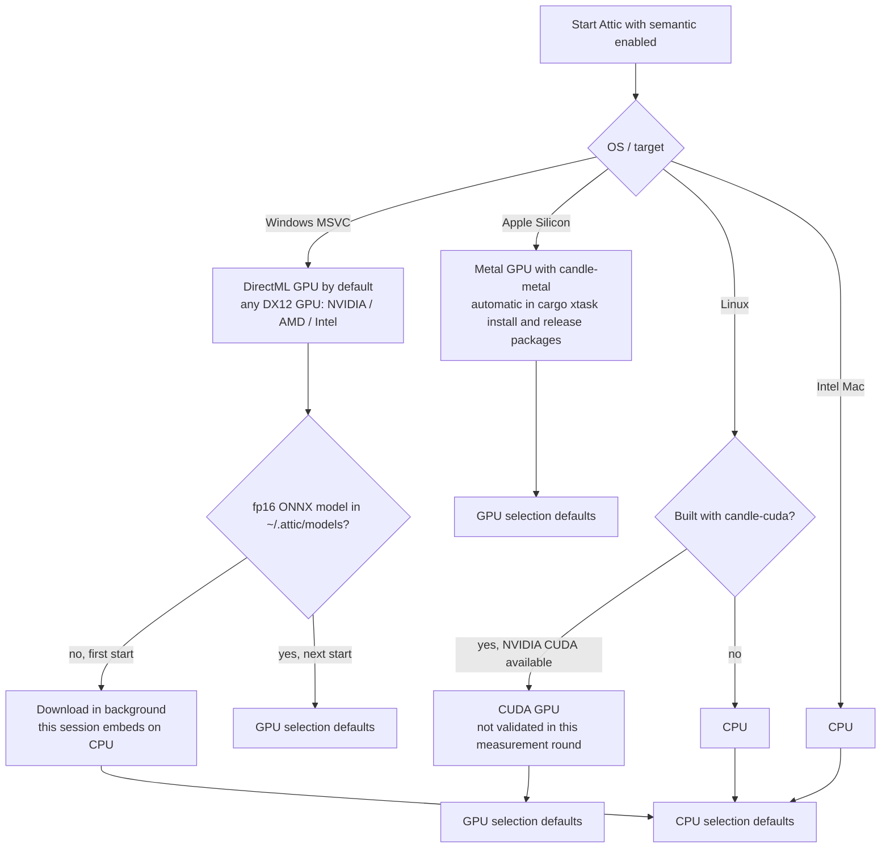
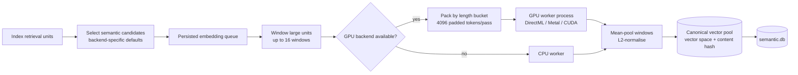

# ⏱️ Attic — Performance and sizing

What to expect when Attic indexes your repositories, and how to measure it on
your own code. Every number here is a direct measurement from 29–30 Sep 2026
unless it is explicitly marked **estimate**.

> [!NOTE]
> Search never waits for embeddings. Lexical and structural results are
> available first; semantic candidates join automatically as vectors appear.

**Measurement setup.** NVIDIA RTX A500 Laptop GPU, 4 GB (3,965 MiB reported),
Windows, DirectML fp16 ONNX, laptop power-capped at about 25 W and 82–84 °C
under sustained load. Model: `Qwen/Qwen3-Embedding-0.6B`.

## Contents

- [The short version](#the-short-version)
- [Indexing (lexical + structural)](#indexing-lexical--structural)
- [Embeddings (semantic layer)](#embeddings-semantic-layer)
- [Sizing your own workspace](#sizing-your-own-workspace)
- [Tuning](#tuning)
- [Benchmark your own repositories](#benchmark-your-own-repositories)
- [Not yet measured](#not-yet-measured)

## The short version

| You want | Expectation |
|---|---|
| Search a freshly added repository | Seconds to about a minute — lexical and structural indexing is fast |
| See an edit reflected | Well under a second of work per changed file, after a short debounce |
| Full semantic coverage on a 4 GB DirectML GPU | Minutes for small/medium repositories; hours for very large corpora, depending on chunk size |
| Full semantic coverage on CPU | **Estimate:** much slower (earlier CPU throughput was ≈0.7–1.6 chunks/s), so defaults intentionally select less work |

> [!TIP]
> Chunks/s is not portable across corpora. The stable metric on the measured
> GPU is **≈5,600–6,000 padded tokens/s** (about 700 ms per 4,096-token pass).

### Which backend/defaults do I get?



Explicit `[semantic]` values in `attic.toml` override both GPU and CPU
automatic defaults. Startup logs `semantic selection defaults` with the values
chosen for that run. If a GPU later falls back to CPU at runtime, the startup
selection defaults remain in effect.

## Indexing (lexical + structural)

Cold database, production pipeline, optimized build:

| Corpus | Size | Result |
|---|---|---|
| Synthetic mixed-language benchmark (the default bench corpus) | 800 files, 112,784 retrieval units | **21.8 s** cold · 26.0 s full re-index of the unchanged tree · **4.1 s** incremental republish of 300 edited files |
| JSON environment exports | 18 files, 21 MB (five ~4.5 MB exports, 3 unsupported DOCX/PDF reported) | **9.6 s** · 45,110 units collapsing to 10,596 distinct bodies (77% canonical dedup) |
| Enterprise multi-repository workspace (AEM + Java) | 20 nested repositories, ~224k files on disk, 12,161 eligible | **≈1 min** · 95,886 units |

Where the time goes (synthetic benchmark, cold): per-file analysis ≈53%,
database publication ≈44%, discovery ≈2%. Analysis runs on all but two
logical CPUs (largest files first, so one huge file never serializes the tail);
publication goes through the single writer in large prepared-statement
batches.

> [!NOTE]
> Reconcile now writes all occurrence and queue rows in one transaction. On the
> Dump corpus, indexing→queue-ready time improved from **30.7 s** to **8.7 s**.

## Embeddings (semantic layer)

Model: `Qwen/Qwen3-Embedding-0.6B`. The fp16 ONNX model is about **1.2 GB** and
is downloaded into `~/.attic/models` in the background on first start. Attic
does not use `~/.cache/huggingface`.

### Embedding pipeline



### Selection defaults

| Key | GPU (DirectML / Metal / CUDA) | CPU |
|---|---:|---:|
| `min_score` | `0.0` | `0.30` |
| `max_units_per_repo` | `100000` | `2560` |
| `max_file_bytes` | `8388608` (8 MiB) | `262144` (256 KiB) |
| `max_units_total` | `100000` | `100000` |

Reason: on the measured GPU, full coverage costs minutes for typical
repositories; on CPU it would be about **1 hour per repository** (**estimate**),
so CPU defaults stay conservative. With CPU-style defaults, the Dump corpus
embeds only **66** documentation chunks; the large JSON exports remain
lexical-only.

### Windowing, packing and worker behaviour

- **Windowed embedding.** A unit larger than one model window is split on
  character/line boundaries into up to **16** windows. Each window is embedded,
  then vectors are length-weighted mean-pooled and L2-normalised into one
  vector. Units that fit one window are embedded unchanged (bit-identical
  vectors). If dense text still exceeds the token window, only that unit is
  bisected and re-split at half the window, at most **2** times. Nothing is
  truncated; units bigger than 16 windows are excluded and counted as
  `exceeds_max_input_bytes`.
- **Model window.** DirectML uses `onnx_seq_len = 512` on cards below **6 GB**
  (1 KiB per window) and `1024` otherwise (2 KiB per window).
- **GPU pass packing.** Length buckets are
  `32/48/64/96/128/192/256/384/512` — powers of two plus 1.5× midpoints — with
  **7–20% less padded work** measured with the real tokenizer. The default
  `gpu_batch_tokens` is **4096 padded tokens per pass**.
- **DirectML efficiency.** The run requests only `last_hidden_state`; the
  previous 56 unused KV-cache tensors copied about **448 MiB** per pass to host
  memory. DirectML memory pattern is disabled, as required by ONNX Runtime for
  this dynamic-shape use.
- **Thermal guard.** GPU temperature is read in the background via
  `nvidia-smi` on NVIDIA Windows/Linux and hwmon on Linux. It is inactive on
  macOS and non-NVIDIA Windows. `nvidia-smi` is killed after **5 s**. Embedding
  pauses at **90 °C** and resumes at **85 °C**.
- **Failures.** Content errors such as too many tokens or too-large units never
  count toward GPU→CPU demotion and never force a model reload.
- **Progress.** `status` → `semantic_progress.chunks_per_sec` is a wall-clock
  rate over the last **120 s**, not a per-poll burst delta.

### Measured results

Full-coverage settings, GPU, 0 failures, no CPU fallback:

| Corpus | Chunks | Selected (after dedup) | Throughput (wall, since first embed) | First embed | Full embed |
|---|---:|---:|---:|---:|---:|
| Dump folder: five 3.4–4.9 MB AEM form-code JSON exports + a few docs | 45,110 | 10,596 | **13.7 chunks/s** (was 9.97 before reconcile/memory-pattern fixes) | **34 s** (was 71 s) | **≈13 min** (**projection** from measured rate) |
| AEM Forms project (client codebase, 2,245 files, 133 MB) | 5,019 | 3,220 | **6.22 chunks/s** (was 3.4 before reload/token fixes; measured before reconcile fix) | **30 s** | **≈9 min** (**projection**) |
| Attic repo (small code chunks, ~34 tokens/chunk) | 11,142 | 11,142 | **76–89 chunks/s** (earlier measurement) | — | **≈2.5 min** |

AEM Forms project chunks average **5.6 model windows per chunk** (713 windows per 128 chunks)
versus about **1.1** on Dump, so that project reports fewer chunks/s even when the GPU
is doing comparable token work. VRAM never limited a pass (`shrunk_by_vram = 0`)
and thermal/VRAM waits were **0–63 ms** per batch.

> [!WARNING]
> Do not raise `gpu_batch_tokens` on 4 GB cards without measuring. On the AEM Forms project,
> **8192** padded tokens/pass dropped throughput to **2.83 chunks/s** versus
> **6.22 chunks/s** at **4096**, with VRAM peaking at **3,899 / 4,096 MiB** and
> spilling into shared memory.

<details>
<summary><b>Debug lines and status fields</b></summary>

Set `ATTIC_LOG=debug` to see per-batch diagnostics:

- `semantic batch`: claimed, embedded, input bytes, prep ms, embed ms, commit ms
- `DirectML embed batch`: items, passes, `shrunk_by_vram`, tokenize ms,
  forward ms, wait ms, total ms

Worker stderr is forwarded to the parent process. `status` reports
`semantic_progress`, `semantic_identity`, and `diagnostics.why_slow`.

</details>

## Sizing your own workspace

**Estimate** the semantic workload from the text that will actually be
embedded:

1. Start from source bytes, minus `.gitignore`, built-in skips,
   `[indexing] exclude`, `[semantic] exclude_globs`, and `[semantic]
   max_file_bytes`. Identical bodies are embedded once.
2. Estimate unique tokens. For mixed code/prose, bytes ÷ 4 is a rough first
   pass; dense generated data may differ.
3. Use the measured padded-token rate:
   `time ≈ unique_tokens × 1.25 padding ÷ 5,800 tokens/s`.

| Workload | Estimate basis | Time estimate on the measured GPU |
|---|---|---:|
| 1 M unique tokens | Formula above | **≈3.5–4 min** |
| 10 M unique tokens | Formula above | **≈36 min** |
| 40 M unique tokens | Formula above | **≈2.4 h** |
| 500,000 Dump-sized chunks | Measured Dump chunks/s | **≈10 h** |
| 500,000 AEM-Forms-project-sized chunks | Measured AEM Forms project chunks/s | **≈22 h** |
| CPU full coverage | Earlier CPU throughput ≈0.7–1.6 chunks/s | Far slower; narrow selection or use GPU |

All values in this table are **estimates**. Replace them with local
measurements when sizing a production workspace.

## Tuning

| I want… | Change… | Notes |
|---|---|---|
| Full semantic coverage on a GPU | Usually nothing | GPU defaults are `min_score = 0.0`, `max_units_per_repo = 100000`, `max_file_bytes = 8 MiB`, `max_units_total = 100000` |
| Less embedding work | `[semantic] exclude_globs`, lower `max_file_bytes`, raise `min_score`, lower `max_units_per_repo` | Good for generated, vendored, snapshot or export data |
| CPU to behave like GPU coverage | Set the GPU values explicitly under `[semantic]` | CPU time can be about 1 h per repository (**estimate**) |
| Keep a 4 GB GPU out of shared memory | Keep `gpu_batch_tokens = 4096` | 8192 was slower on the measured 4 GB card |
| Try bigger passes on a larger GPU | Raise `gpu_batch_tokens`, then measure | Watch `shrunk_by_vram`, VRAM peak and chunks/s |
| Reduce hot-laptop pauses | Lower `gpu_temp_pause_c` / `gpu_temp_resume_c` | Defaults are 90 °C / 85 °C |
| Fit a small GPU | Let `onnx_seq_len` auto-select 512 below 6 GB, or set 512 explicitly | Units above one window are mean-pooled, not truncated |
| Free VRAM sooner | Lower `gpu_idle_unload_secs` | Default is 900 s; 0 keeps the model resident |
| Linux NVIDIA GPU | Build with `--features candle-cuda` | Not validated in this measurement round |
| Apple Silicon GPU | Use `cargo xtask install` or the aarch64 release package | It enables `candle-metal` automatically; throughput not yet measured |
| Lexical-only search | `ATTIC_SEMANTIC=0` or `[semantic] enabled = false` | No model download, no `semantic.db` growth |
| Debug slow embeddings | `ATTIC_LOG=debug`, then inspect `semantic batch` and `DirectML embed batch` | Also check `status.diagnostics.why_slow` |

## Benchmark your own repositories

Both benchmarks are opt-in and read-only: they never modify the directory
they measure.

<details open>
<summary><b>PowerShell</b></summary>

```powershell
# Indexing: cold, warm and incremental timings with a per-stage breakdown
$env:ATTIC_BENCH_INDEX = '1'
$env:ATTIC_BENCH_ROOT  = 'C:\code\my-repo'      # omit for the synthetic corpus
cargo test --release -p attic-indexing --test index_throughput_bench -- --ignored --nocapture

# Embeddings: real-model CPU/GPU throughput and batch equivalence (needs the cached model)
$env:ATTIC_BENCH_QWEN        = '1'
$env:ATTIC_BENCH_QWEN_CORPUS = 'C:\code\my-repo' # omit to sample Attic's own sources
cargo test --release -p attic-semantic --test qwen3_throughput_bench -- --ignored --nocapture
```

</details>

<details>
<summary><b>Linux / macOS shell</b></summary>

```sh
ATTIC_BENCH_INDEX=1 ATTIC_BENCH_ROOT=/code/my-repo \
  cargo test --release -p attic-indexing --test index_throughput_bench -- --ignored --nocapture

ATTIC_BENCH_QWEN=1 ATTIC_BENCH_QWEN_CORPUS=/code/my-repo \
  cargo test --release -p attic-semantic --test qwen3_throughput_bench -- --ignored --nocapture
```

</details>

Further knobs: `ATTIC_BENCH_THREADS`, `ATTIC_BENCH_REPLICAS`,
`ATTIC_BENCH_INCR_FILES`, `ATTIC_BENCH_QWEN_ITEMS`, `ATTIC_BENCH_QWEN_BATCH`
and `ATTIC_BENCH_QWEN_CHUNK_BYTES` (see the header of each benchmark file).

## Not yet measured

- Metal throughput on Apple Silicon.
- CUDA throughput on Linux NVIDIA after `--features candle-cuda`.
- p95 query latency under concurrent MCP load while indexing and embedding.
