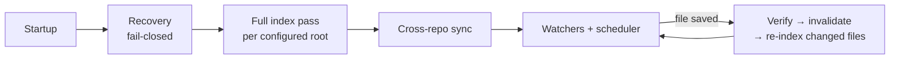

# 📘 Attic — Operations & Development Playbook

Practical manual for running, troubleshooting, recovering and extending Attic.
For what Attic is, start with the [README](../README.md); for how it is built,
[`ARCHITECTURE.md`](ARCHITECTURE.md).

## Contents

- [Operation](#operation)
  - [Start and stop](#start-and-stop) · [Indexing lifecycle](#indexing-lifecycle)
  - [Checking health](#checking-health) · [Managing repositories](#managing-repositories)
  - [Several windows, one workspace](#several-windows-one-workspace)
  - [Project knowledge](#project-knowledge) · [Semantic search on/off](#semantic-search-onoff)
- [Troubleshooting](#troubleshooting)
- [Recovery](#recovery)
- [Adding a language or platform](#adding-a-language-or-platform)
- [Development](#development)
- [Maintenance](#maintenance)

## Operation

### Start and stop

Your MCP client normally starts Attic for you. To run it by hand, set a
workspace root and launch the installed binary.

<details open>
<summary><b>PowerShell</b></summary>

```powershell
$env:ATTIC_WORKSPACE_ROOT = 'C:\code\repo'
~\.attic\attic-server.exe
```

</details>

<details>
<summary><b>cmd.exe</b></summary>

```bat
set ATTIC_WORKSPACE_ROOT=C:\code\repo
%USERPROFILE%\.attic\attic-server.exe
```

</details>

<details>
<summary><b>Linux / macOS shell</b></summary>

```sh
ATTIC_WORKSPACE_ROOT=/code/repo ~/.attic/attic-server
```

</details>

With no workspace configured anywhere, Attic starts **unconfigured**: it
answers `status` and `workspace`, and query tools return a clear "workspace
not configured" error until you add a repository.

Attic stops on Ctrl+C, or — as a daemon — once no client has been connected
for the idle timeout (90 s by default). Both paths run the same graceful
shutdown: stop accepting work, stop watchers and the scheduler, stop semantic
workers, record a clean-shutdown marker, prune old records, checkpoint the
WAL, write a crash-recovery backup and close the databases.

> [!NOTE]
> On macOS, a replacement daemon can take over a killed daemon's leftover
> socket file, so relay/daemon failover does not require manual socket cleanup.

### Indexing lifecycle



- **Startup** — `run_startup_recovery` runs before anything is served:
  interrupted tasks return to `PENDING`, interrupted refreshes return to
  `STALE`, in-progress secret scans restart, and the database integrity check
  must pass.
- **Full index pass** — runs in the background right after startup for
  every configured root (tools answer immediately; `status` shows each
  repository's state). It is authoritative: paths deleted or newly excluded
  while Attic was stopped are tombstoned, and unchanged files are reproduced
  from the analysis cache instead of being re-analyzed.
- **Incremental** — a native file watcher (falling back to periodic
  reconciliation if the OS watch cannot be established) debounces changes
  for 500 ms, verifies them against real content hashes, invalidates the
  affected artifacts and re-indexes only the changed files. `status`'s
  `watcher.mode` says which mechanism is active.

### Checking health

Ask your client for Attic's status, or call the `status` tool. Key fields:

| Field | Meaning |
|---|---|
| `status` | `ok`, or `unconfigured` until a repository is configured |
| `workspace.repositories[]` | Per-repository state, watcher mode and any error |
| `incremental.state` | `CURRENT` / `INDEXING` / `RECONCILIATION_REQUIRED` / `UNKNOWN` |
| `incremental.tasks` | Pending/running background tasks |
| `semantic_progress` | Embedding queue depth and completion |
| `diagnostics.why_slow` | Plain-language bottleneck diagnosis |
| `resource_pressure` | Memory tier (`normal`/`warning`/`critical`/`emergency`) and effective limits |
| `resource_mode` / `resource_mode_source` | Selected low/balanced/performance tier and where it came from |

### Managing repositories

Membership is managed live through the `workspace` tool — no restart, no file
editing. Tell your client *"add D:\new-service to Attic"*, or call it directly:

| Action | Effect |
|---|---|
| `{"action":"inspect"}` | Configured and active roots, per-repository state |
| `{"action":"add","path":"..."}` | Validate, index, watch and persist a new root |
| `{"action":"remove","path":"..."}` | Stop watching; the repository immediately disappears from search, context and status |
| `{"action":"set","paths":[...]}` | Replace the whole membership |

Membership is written atomically to `<ATTIC_HOME>/config/config.toml`. A removed
repository disappears from results immediately, and its stored data (index,
embeddings) is deleted in the background; adding it back before that finishes
cancels the deletion. A configured root that is temporarily unavailable (say, an
unmounted drive) is reported under `workspace.unavailable_repositories` while
the others keep working.

### Several windows, one workspace

Any number of clients may launch Attic against the same `ATTIC_HOME`. The
first launch becomes the **daemon** (single writer, watchers, recovery); later
launches become **relays** over a local socket (Unix domain socket or Windows
named pipe). If the daemon exits or crashes, a relay re-elects itself as the
daemon without disconnecting its own client. Different `ATTIC_HOME`s are fully
independent workspaces.

### Project knowledge

Create `knowledge/*.md` files in a repository for durable facts that the code
does not show: architecture rationale, domain vocabulary, conventions,
ownership, deployment topology. See [`knowledge/README.md`](../knowledge/README.md)
for the template.

- Keep one topic per file; edit it like any other file — the watcher
  re-indexes it.
- A contradiction between knowledge and current source is **surfaced**, never
  silently resolved — treat it as a sign the knowledge file needs updating.
- Never store secrets there: knowledge files are served like source code.

### Semantic search on/off

Semantic search is **on by default**. Turn it off with `ATTIC_SEMANTIC=0` or
`[semantic] enabled = false`; delete `semantic.db` to reclaim the disk.
Canonical (lexical/structural) retrieval never depends on it.


Backend defaults:

| Platform | Default backend |
|---|---|
| Windows MSVC | DirectML GPU on any DX12 GPU (NVIDIA / AMD / Intel) |
| Apple Silicon | Metal GPU via `candle-metal` (automatic with `cargo xtask install`) |
| Linux | CPU; NVIDIA CUDA requires `--features candle-cuda` and was not validated in the Sep 2026 measurement round |
| Intel Mac | CPU |

Selection defaults also depend on backend, unless explicitly set in
`attic.toml`:

| Key | GPU | CPU |
|---|---:|---:|
| `min_score` | `0.0` | `0.30` |
| `max_units_per_repo` | `500000` | `2560` |
| `max_file_bytes` | `8388608` (8 MiB) | `262144` (256 KiB) |
| `max_units_total` | `500000` | `500000` |

The server logs `semantic selection defaults` at startup. If the GPU later
falls back to CPU at runtime, the startup defaults remain. The installers run
`attic-server setup-models`, which downloads the fp16 ONNX model (~1.2 GB, GPU
first when eligible) into `~/.attic/models` before the first session. If it is
still missing at start, Attic downloads it in the background; that session
embeds on CPU and the GPU backend is used from the next start. Once the
models are ready, `setup-models` and the server remove files they never read:
the ONNX download cache (`models--onnx-community--…`, kept only until
`onnx-fp16/` is complete) and, on Windows, duplicate `blobs/` copies (replaced
by hard links). About 2.3 GB stays on disk instead of ~4.6 GB.

> [!TIP]
> `status.semantic_progress.chunks_per_sec` is measured from committed
> enrichment batches over the last 300 s, so it does not jump between zero and
> a per-poll burst rate.

### Attic home layout

`ATTIC_HOME` defaults to `~/.attic`. Startup creates the home directory,
`data/` (with `attic.db*`), `config/` (with `attic.toml` when missing) and
`run/` (daemon lock/address). A legacy flat home is migrated into these folders
once (skipped for a run while an older Attic still holds the lock). The move is
all-or-nothing — databases travel with their `-wal`/`-shm` files, a failed
attempt is rolled back, and an interrupted one is resumed on the next start.
Other directories are
lazy: `models/` is created only for model downloads, `logs/` only after the
`logging` tool is turned on (`action=on`, optional `level=debug|trace|…`) or
`[logging] file_level` is set in `attic.toml` (applied at every start), and
`backups/` only after the shutdown backup first succeeds.
Attic does not read from or write to `~/.cache/huggingface`; model assets live
under `ATTIC_HOME`.

## Troubleshooting

| Problem | What to check |
|---|---|
| MCP won't connect | Absolute `command` path; errors are on **stderr** — stdout carries only MCP |
| Exits immediately | stderr: invalid `attic.toml` or `ATTIC_*` value (both fail closed), unreadable root, failed integrity check |
| Repository missing | `workspace {"action":"inspect"}`; `status.workspace.unavailable_repositories` |
| File missing | `.gitignore`, built-in skipped folders, `[indexing] exclude` |
| Results stale | `status.incremental.state`; the `file` tool reads live and appends an `[index freshness: …]` note on drift |
| Indexing seems stuck | `status.incremental.tasks` not decreasing across calls; stderr scheduler errors |
| Watcher degraded | `status.watcher.mode` = `periodic-reconciliation` — a documented fallback, not a crash |
| Cross-repo answers withheld | Startup cross-repo sync not finished or failed (stderr `cross-repo workspace sync failed`); single-repo retrieval unaffected |
| No semantic results yet | `status.semantic_progress`; first model download embeds on CPU and GPU starts on the next launch when `~/.attic/models/onnx-fp16` exists |
| GPU expected, CPU used on Windows | Check the Rust target. DirectML is automatic on Windows MSVC; if Cargo config forces GNU, set `CARGO_BUILD_TARGET=x86_64-pc-windows-msvc` |
| GPU slow or hot | `ATTIC_LOG=debug`; inspect `DirectML embed batch` wait/forward times, `shrunk_by_vram`, and temperature. Thermal pause/resume defaults are 90 °C / 85 °C |
| "server busy" / memory | `status.resource_pressure`; raise `total_memory_budget_mib` / `max_foreground_queries`, or index fewer repositories at once |
| Disk usage | `attic.db*`, `semantic.db`, lazy `models/` / `backups/` under `ATTIC_HOME` — not Cargo's `target/` or `~/.cache/huggingface` |

<details>
<summary><strong>Details and diagnostics</strong></summary>

- **Relay says the daemon never published an address.** Another process holds
  `attic.lock` but has no `attic.ipc`: it is still starting, serving a single
  client because its socket could not be created, or hung. Stop it and
  relaunch. On macOS, a replacement daemon can take over a killed daemon's
  leftover socket file.
- **"workspace not configured"** is the intended first-run state — configure
  through the `workspace` tool, `ATTIC_CONFIG` or `ATTIC_WORKSPACE_ROOT`.
- **Semantic debug logging.** `ATTIC_LOG=debug` adds `semantic batch` lines
  (claimed, embedded, input bytes, prep/embed/commit ms) and `DirectML embed
  batch` lines (items, passes, `shrunk_by_vram`, tokenize/forward/wait/total
  ms). Worker stderr is forwarded.
- **Content errors.** Too-large or too-token-heavy units are counted for that
  unit only; they do not demote GPU to CPU and do not force a model reload.
- **Disk over time.** Every clean shutdown (including the daemon's idle exit)
  prunes tombstones, invalidation records and finished tasks past their
  retention (90 / 90 / 30 days) and vacuums both databases, so size tracks
  indexed content rather than growing without bound.

</details>

## Recovery

| Situation | What to do |
|---|---|
| Killed mid-index | Nothing — startup recovery resumes; partial publications are never visible |
| Start over | Stop Attic, delete `attic.db`, `attic.db-wal`, `attic.db-shm`; restart. Always safe: everything is rebuilt from source |
| Integrity check fails | Attic refuses to serve. Move `attic.db*` aside, then copy the newest file from `backups/` to `attic.db`, or start over |
| Rebuild embeddings | Delete `semantic.db` and restart |
| "schema version not supported" | An older binary opened a newer database: upgrade the binary, or start over |

Attic never writes into a workspace, so no recovery step can touch your
source.

## Adding a language or platform

Every language or platform is an **analyzer plugin**
(`crates/attic-analyzers/src/plugin.rs`). Indexing, storage, retrieval and the
server never change when you add one. Pick the smallest path that fits:

| Path | Effort | You get | Example |
|---|---|---|---|
| **A · Tags query** | ~30 lines | Symbol definitions + in-file references | Kotlin, Swift, Rust |
| **B · Full analyzer** | A few hundred lines | Symbols, imports, relationships | Java, Python, Go |
| **C · Platform plugin** | Your own `AnalyzerPlugin` | Path-aware classification + custom structure | AEM |

<details open>
<summary><b>A · A language with a tree-sitter grammar (worked example: Kotlin)</b></summary>

1. **Add the grammar** to the workspace `Cargo.toml` and to
   `crates/attic-analyzers/Cargo.toml`:

   ```toml
   tree-sitter-kotlin-ng = { workspace = true }   # workspace: "1.1"
   ```

2. **Write (or reuse) a tags query** in
   `crates/attic-analyzers/src/structural/tags_generic.rs`. Use the grammar's
   own `queries/tags.scm` when it ships one; otherwise author the definitions
   you want from its `node-types.json`:

   ```rust
   const KOTLIN_TAGS_QUERY: &str = r#"
   (class_declaration name: (identifier) @name) @definition.class
   (object_declaration name: (identifier) @name) @definition.object
   (function_declaration name: (identifier) @name) @definition.function
   "#;
   ```

3. **Add one row** to the language table in the same file:

   ```rust
   TagsLanguageSpec {
       analyzer_id: "kotlin-tags",
       language_tag: "kotlin",
       description: "tree-sitter-tags structural analyzer for Kotlin: …",
       grammar: tree_sitter_kotlin_ng::LANGUAGE,
       tags_query: KOTLIN_TAGS_QUERY,
       locals_query: "",
   },
   ```

4. **Claim the file extensions** with one line in `builtin_plugins()` in
   `plugin.rs`:

   ```rust
   tier2("kotlin", "Kotlin: classes, objects, functions and type aliases",
         &[], &[("kt", "kotlin"), ("kts", "kotlin")]),
   ```

5. **Test it** with a small fixture in
   `crates/attic-analyzers/tests/structural_tags_tier2.rs`, and add the id to
   the `Built-in ids` comment in `ATTIC_TOML_TEMPLATE`
   (`crates/attic-core/src/config.rs`) — a unit test fails until you do.

</details>

<details>
<summary><b>B · A full, hand-written analyzer</b></summary>

Implement `TreeSitterLanguageSpec` in a new module under
`crates/attic-analyzers/src/structural/` (use `java.rs` or `python.rs` as the
template: symbols, imports, heritage, calls), then register it in
`builtin_plugins()` with `Registration::Specialized(your_module::analyzer)`.
Declare capabilities honestly in the analyzer descriptor — never claim a
relationship level the analyzer does not produce. Add a fixture under
`crates/attic-analyzers/tests/fixtures/` and cover it in
`language_specific_extraction.rs` and `language_invariants_matrix.rs`.

</details>

<details>
<summary><b>C · A platform plugin (like AEM)</b></summary>

Implement the four-method trait. Paths arrive normalized (`/` separators,
lowercase), so a plugin behaves identically on Windows, macOS and Linux:

```rust
use std::sync::Arc;
use attic_analyzers::{AnalyzerPlugin, AnalyzerRegistry, PluginPath};

struct TerraformPlugin;

impl AnalyzerPlugin for TerraformPlugin {
    fn id(&self) -> &'static str { "terraform" }                  // attic.toml id
    fn description(&self) -> &'static str { "Terraform modules and resources" }
    fn language_hint(&self, path: &PluginPath) -> Option<&'static str> {
        matches!(path.extension(), Some("tf") | Some("tfvars")).then_some("terraform")
    }
    fn register(&self, registry: &mut AnalyzerRegistry) {
        registry.register_for_language("terraform", Arc::new(TerraformAnalyzer::new()));
    }
}
```

Add it to `builtin_plugins()` — before the generic extension rules if it
claims paths by layout, as `aem.rs` does for `jcr_root/` — or compose it at
runtime with `PluginCatalog::builtin().with_plugin(Arc::new(TerraformPlugin))`
(duplicate ids are rejected). Parse tolerantly: malformed input should yield
partial structure plus a warning, never a failed file.

</details>

**Rules for every path:** a disabled plugin's files stay searchable through
`GenericAnalyzer`; plugin ids are lowercase and stable (they appear in
`attic.toml`); and bump `ANALYZER_REGISTRY_VERSION`
(`crates/attic-core/src/constants.rs`) whenever an existing analyzer's output
changes, so cached analyses are recomputed on the next start.

## Development

> [!WARNING]
> These commands run Cargo. Do not run them while another build is holding the
> target lock unless you intentionally want to wait.

```sh
rustup show                                   # installs the pinned toolchain
cargo build --package attic-server            # debug build → target/debug/attic
cargo test -p <crate>                         # focused, fast inner loop
cargo test --workspace                        # everything
cargo fmt --all
cargo clippy --workspace --all-targets -- -D warnings
```

### Pre-commit checks and local install

The same commands work on Windows, Linux and macOS:

```sh
cargo xtask check
cargo xtask install
```

`cargo xtask check` is exactly:

```sh
cargo fmt --all --check
cargo clippy --workspace --all-targets -- -D warnings
cargo test --workspace
```

`cargo xtask install` performs a release build of `attic-server`, stops any
running local `attic-server` / `attic`, and installs the binary plus runtime
libraries (for example `DirectML.dll`) into `$ATTIC_HOME` or `~/.attic`. It
uses Cargo's JSON output to find the executable, so a configured `[build]`
target is honoured, and replaces files via temp+rename so macOS code
signatures remain valid. It then runs `attic-server setup-models`
(`--skip-models` skips it). On Windows it builds for MSVC unless
`CARGO_BUILD_TARGET` is set. `cargo xtask all` = `cargo fmt --all` + check +
install.

On Apple Silicon it automatically adds `--features candle-metal`, matching the
`aarch64-apple-darwin` release packages. On Windows MSVC, DirectML is built in
automatically; the legacy `ort-directml` feature is a no-op kept for old
scripts. Linux defaults to CPU; NVIDIA CUDA requires `--features candle-cuda`
and was not validated in the Sep 2026 measurement round.

The real-GPU end-to-end test runs automatically inside `cargo test` when
`~/.attic/models/onnx-fp16` exists; `ATTIC_RUN_MODEL_E2E=0` skips it.

<details>
<summary><b>Toolchains per platform</b></summary>

- **Windows (recommended):** rustup's default `x86_64-pc-windows-msvc` plus
  Build Tools for Visual Studio with the C++ workload. DirectML is automatic;
  no feature flag is needed.

  `cargo xtask` builds for MSVC automatically when `CARGO_BUILD_TARGET` is
  unset. For plain `cargo` commands with a personal Cargo config that forces
  GNU (`x86_64-pc-windows-gnu`), override it:

  ```powershell
  $env:CARGO_BUILD_TARGET = 'x86_64-pc-windows-msvc'
  cargo xtask check
  cargo xtask install
  ```

  In `cmd.exe`:

  ```bat
  set CARGO_BUILD_TARGET=x86_64-pc-windows-msvc
  cargo xtask check
  cargo xtask install
  ```

- **Linux:** a system C compiler (`build-essential` / `gcc`). CPU is the
  default semantic backend. CUDA is opt-in with `--features candle-cuda`.
- **macOS:** `xcode-select --install`. Apple Silicon gets Metal automatically
  through `cargo xtask install`; Intel Mac uses CPU.

</details>

<details>
<summary><b>Opt-in tests, benchmarks and test hooks</b></summary>

| Variable | Purpose |
|---|---|
| `ATTIC_BENCH_INDEX=1` (+ `ATTIC_BENCH_ROOT`, …) | Indexing benchmark — see [`PERFORMANCE.md`](PERFORMANCE.md) |
| `ATTIC_BENCH_QWEN=1` (+ `ATTIC_BENCH_QWEN_CORPUS`, …) | Real-model embedding benchmark |
| `ATTIC_RUN_MODEL_E2E=0` | Skip the real-GPU e2e test that runs automatically when `~/.attic/models/onnx-fp16` exists |
| `ATTIC_ACCEPTANCE_DUMP=<dir>` | Frozen-count acceptance run over the reference JSON-export corpus |
| `ATTIC_ACCEPTANCE_WORKSPACE=<dir>` | Frozen-count acceptance run over the reference 20-repository workspace |
| `ATTIC_FORCE_RESOURCE_PRESSURE` | Fault injection: start at a fixed pressure tier |
| `ATTIC_FORCE_CPU_CORES=<n>` | Test hook: pin the detected physical core count so resource tests don't depend on the machine |
| `ATTIC_PRESSURE_OVERRIDE_FILE` | Fault injection: a file whose content (`normal`…`emergency`) forces the tier while it exists |
| `ATTIC_FAST_RECOVERY_MS` | Fault injection: shorten graduated-recovery dwell times |
| `ATTIC_MOCK_WORKER` | Inference-worker test double: `echo` / `hang` / `corrupt` / `crash` |

The acceptance runs assert exact counts for their reference corpora and are
skipped when the variable is unset; everything else in the suite is
self-contained (temporary directories, no network, no global Git config).

</details>

`target/` is Cargo's build cache, not Attic's index — `cargo clean` is always
safe.

## Maintenance

<details open>
<summary><strong>Procedures</strong></summary>

- **Schema changes** — migrations are ordered and forward-only. Add
  `migrations/000N_<name>.sql` (core, wired into `run_migrations` in
  `crates/attic-storage/src/migration.rs`) or
  `migrations/semantic/000N_<name>.sql` (wired into `SemanticStore::migrate`).
  Each script records itself; never edit one that has shipped. A database
  carrying a version the binary does not know is refused, not guessed at.
- **Analyzer or grammar update** — bump the `tree-sitter-*` dependency, check
  its ABI against `tree-sitter`'s supported range, re-run the analyzer tests,
  and bump `ANALYZER_REGISTRY_VERSION` if output changes.
- **New dependency** — its license must be compatible with
  `MIT OR Apache-2.0`, and it must support Linux, macOS and Windows.
- **Retrieval changes** — modify contracts or candidate generation in
  `crates/attic-retrieval`, then run its regression gates in
  `crates/attic-retrieval/tests/`.
- **Release** — bump `version` in the root `Cargo.toml`; CI
  (`.github/workflows/release.yml`) runs `tools/package.sh --target <triple>`
  for every supported target on tag push. Never weaken
  `tools/package.sh --verify`'s exclusion checks (no `target/`, `*.db*`, logs
  or hidden files) to make a release pass, and never work around a build
  failure by weakening endpoint security (antivirus exclusions, signing
  bypasses) — find the actual cause.

</details>
