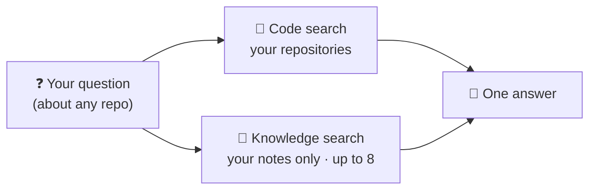

# 🧠 Teach Attic what the code can't tell it

Your code shows **what** the system does. It rarely says **why**, who owns
it, or which rule nobody should break. Write that down once, as a Markdown
note, and Attic gives it to your AI assistant on **every** question, for
**every** repository.

| | Without notes | With notes |
|---|---|---|
| "Why is the retry limit 3?" | 🤷 Guesses from code | ✅ "Billing decided it, see `billing.md`" |
| Same rule in 15 repos | Copy into each repo | ✍️ One note, every repo |
| Question wording | Has to say "ADR", "runbook"… | 💬 Just ask normally |

## ⚡ Set up in under a minute

It's **on by default**. There's nothing to configure.

```text
~/.attic/
└── knowledge/        ← created for you on first start
    ├── billing.md    ← you add notes like this
    └── ownership.md
```

1. Start Attic once, and `~/.attic/knowledge/` appears.
2. Drop `.md` files in it. Edits are picked up automatically.
3. Ask anything. `status` → `knowledge.state` shows `ready` once it's indexed.

## 🔍 What happens when you ask



Your notes get **their own search**, so a thousand matching code files can't
push them out. In the answer, a note looks like this:

```text
## [KNOWLEDGE] billing.md:3:1-3:47
- authority: PROJECT_KNOWLEDGE
```

> [!TIP]
> Want notes only? Use `search` with `scope: "knowledge"`. Every `search`
> result also tells you its `source_type`: `knowledge`, `documentation`,
> `code`, `config` or `test`.

## ✍️ What makes a great note

| ✅ Write | ❌ Skip |
|---|---|
| Why the system is shaped this way | Secrets, tokens, internal URLs |
| Domain terms and business rules | "For this task, do X" instructions |
| Who owns what | Anything meant to be executed |
| How and where things run | Things the code already says clearly |

> [!WARNING]
> Notes are served as written. Attic's secret scanner still runs, but never
> put secrets in a note.

## ⚙️ Make it yours

Change it in `~/.attic/config/attic.toml`, then restart Attic:

| You want… | Add this |
|---|---|
| The default (`~/.attic/knowledge`) | nothing |
| Notes in another folder, e.g. a git repo | `[knowledge]`<br/>`dir = "C:\\path\\to\\attic\\knowledge"` |
| No knowledge at all | `[knowledge]`<br/>`enabled = false` |

> [!NOTE]
> Attic creates only the **default** folder. A folder you name in `dir` must
> already exist; if it doesn't, Attic still starts and `status` →
> `knowledge.reason` says why.

## ❓ Questions

<details>
<summary>Do notes override the code?</summary>

No. Notes are labelled `PROJECT_KNOWLEDGE`: context for your assistant, not
ground truth. Code and tests still show what the system does today. Attic
serves your notes; how your AI client weighs them is up to that client.
</details>

<details>
<summary>Is this README served too?</summary>

No. The folder's own `README.md` is always skipped, so you can keep
instructions in it.
</details>

<details>
<summary>What about <code>knowledge/</code> folders inside a repository?</summary>

They still count as knowledge for that repository. They share the normal
search, though, so code can crowd them out. The central folder is the
reliable option.
</details>

<details>
<summary>I changed <code>dir</code>. What happens to the old notes?</summary>

They stay stored in Attic's database but are never shown again.
</details>
